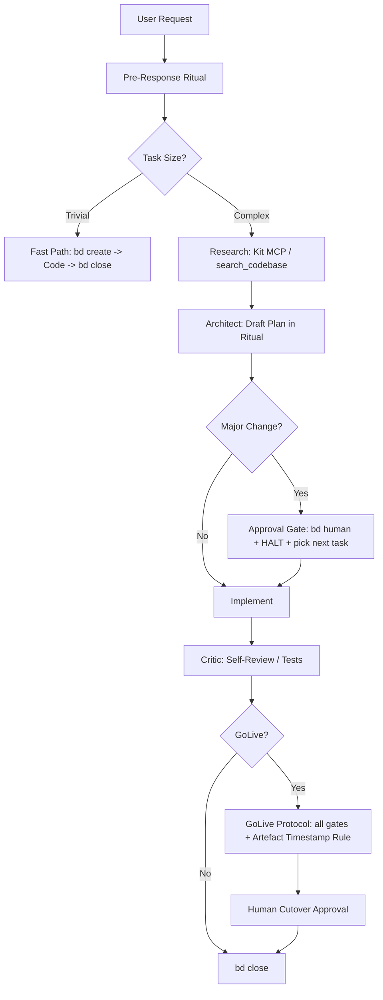

# AGENTS.md

This file provides mandatory operational guidance to agents when working with code in this repository.

## ⛔ ABSOLUTE MANDATE: NEVER TOUCH API KEYS OR `.env.local`
- **NEVER** modify, edit, sanitize, replace, or overwrite API keys or `.env.local` / `.env` files under any circumstances.
- **NEVER** run automated sanitization or guardrail scripts against `.env.local` or `.env`.
- **NEVER** hardcode real API keys into code, unit tests, scratch scripts, docs, or commit messages. All temporary test scripts must be placed in `/tmp` or `scratch/` (gitignored).
- Replacing real API keys with `<REDACTED>` or placeholder values destroys gateway operation by causing `staticValidateKeys` to discard all provider keys on boot.
- `.env.local` is write-protected via `protect.sh` (owned by `root`, read-only `644` for runtime processes). Do not attempt to bypass this.


---

## Technical Knowledge Base
For all system design, folder maps, design decisions, and architectural constraints, refer to:
👉 `docs/ARCHITECTURE.md`
👉 `docs/Longrunning_Mode.md` (Fusion Sticky Fallback details)

---

## MANDATORY WORKFLOW ENFORCEMENT

**Before writing any code or answering any request, you MUST initialize the beads workflow.**

### Session Start Protocol
1. **Run**: `bd prime` (or `bd ready` if prime is unavailable) immediately upon session start.
2. **Verify**: Ensure you have the latest issue context.
3. **Ticket**: If the user's request is not already an issue, create it: `bd create "..." -t task -p 2`.
4. **Claim**: `bd update <id> --claim`.

> **DO NOT PROCEED** without tracking the task in beads. Markdown TODOs and mental notes are PROHIBITED.

---

## MANDATORY PRE-RESPONSE RITUAL

**Before writing any code or executing any command, output this block. No exceptions. Not even for trivial tasks. This is your contract with the user.**

```
### REQUEST INTAKE
I understand you want: [one sentence restatement in your own words]

### CRITICAL ASSUMPTIONS
(Every assumption that, if wrong, invalidates the entire plan)
- [ ] Assumption 1
- [ ] Assumption 2

### RISKS AND UNKNOWNS
(What could break, what must be verified BEFORE touching code)
- Risk 1
- Unknown 1

### PLAN
| Step | Action | Verify By |
|------|--------|-----------|
| 1    | ...    | ...       |
| 2    | ...    | ...       |

### APPROVAL?
- [ ] YES - Major change (>50 lines / new deps) -> HALTING. Reply APPROVED / MODIFY / CANCEL.
- [ ] NO  - Proceeding autonomously. Stating: "Self-approving - YOLO active."
```

### Mode Modifier
- **Antigravity (involved mode):** Always run full ritual. Wait for explicit `APPROVED` before any code.
- **Opencode (YOLO mode):** Run ritual but self-approve if flagged NO. State "Self-approving - YOLO active" and proceed immediately.

> **WHY THIS EXISTS**: The user should never have to ask "did you understand what I want?" or "what's your plan?" - this ritual makes intent visible and front-loads ambiguity resolution before any damage is done.

---

## RESUME PROTOCOL (Mid-Session Restart)

**If you lose context, start a new conversation, or are unsure what was in-flight:**

1. Run `bd list --status in_progress --json` - find any issue with `claimed_by` set. That is YOUR task.
2. Re-read the bead's `--description` and `--acceptance` fields for full context.
3. Continue from the last completed step - **DO NOT restart from scratch**.
4. **NEVER ask the user "what should I work on?"** if `bd list --status in_progress` returns results.
5. If genuinely nothing is in-progress, run `bd ready` and claim the highest-priority unblocked issue.

> **WHY THIS EXISTS**: Agents losing mid-task context and stalling or restarting is the #1 source of wasted effort. The beads DB is your persistent brain - use it.

---

## PROVIDER/MODEL MANAGEMENT PROTOCOLS

Before adding, modifying, or removing providers or models, you MUST:

### 1. Load Literouter-Playbook Skill
> **MANDATORY**: Always load the `literouter-playbook` skill before any provider/model changes:
> ```bash
> skill load "literouter-playbook"
> ```

### 2. Validation Workflow
> Execute this sequence for ALL provider/model changes:
> 
> 1. **Pre-Edit Checkpoint**: Run `uv run python admin/code_hygiene/agent_guardrail.py checkpoint <path>` on modified files
> 2. **Load Playbook**: `skill load "literouter-playbook"`
> 3. **Backup Verification**: Verify gateway health with `bun run scripts/doctor.ts`
> 4. **Test Suite**: Run `bun test && uv run pytest tests/integration/`
> 5. **Post-Edit Validation**: Run `uv run python admin/code_hygiene/agent_guardrail.py validate <path>`

### 3. Required Changes Tracking
> Every provider/model modification MUST be documented in a bead issue:
> ```bash
> bd create "Update providers/models: [specific changes]" -t task -p 2 \
>   --description="Adding/changing/removing providers/models [details]" \
>   --deps discovered-from:<previous-bead-id>
> ```

### 4. Change Categories
> - **Provider Addition**: Requires new gateway routing rules in `src/index.ts`
> - **Model Addition**: Requires OpenAI-compat endpoint configuration in `fusion.json`
> - **Provider Removal**: Requires gateway configuration cleanup in `src/index.ts`
> - **Model Removal**: Requires upstream reference cleanup in `fusion.json`
> - **Key Rotation**: Requires Valkey quota/cooldown state updates

### 5. Integration Testing
> After any provider/model change:
> - ✅ `bun test` passes (TypeScript unit tests)
> - ✅ `uv run pytest tests/integration/` passes (smoke tests against running gateway)
> - ✅ `uv run ruff check .` passes (Python linting)
> - ✅ Manual verification: `curl -H "Authorization: Bearer <KEY>" localhost:7766/health`

### 6. Failure Handling
> If ANY step fails:
> - HALT immediately
> - Link discovered failures as dependency from the change bead
> - Run `./bd ready` to pick up next unblocked work
> - DO NOT proceed to next step until previous issues are resolved

---

## APPROVAL GATE - NON-BLOCKING BEHAVIOUR

When halted at an Approval Gate (major change >50 lines, new deps, schema changes):

1. Write the full plan to the bead: `bd update <id> --design "...plan text..."`
2. State clearly in chat: `APPROVAL REQUIRED: [specific decision needed in one sentence]`
3. Flag for human: `bd human <id>`
4. **STOP** - do not loop, do not ask again, do not proceed.
5. **Pick up next unblocked work**: run `bd ready` and claim the next issue while waiting.

> **WHY THIS EXISTS**: Agents that halt and wait indefinitely block all progress. Flag it, park it, move on. You are not a single-threaded process.

---

## GOLIVE / CUTOVER PROTOCOL

**"Testing complete" and "Ready for GoLive" are INVALID claims unless ALL gates below pass and produce artifacts.**

| Gate | Command | Evidence Required | Environment |
|------|---------|-------------------|-------------|
| Lint | `uv run ruff check .` | Zero errors output (Python test files) | Local |
| Unit | `bun test` | All pass, exit code 0 | Local |
| Integration / Smoke | `uv run pytest tests/integration/` | All pass against a running gateway, exit code 0 | Local |
| Full Suite | `bun test && uv run pytest tests/integration/` | `tests/test_results.md` updated with current timestamp | Local |
| E2E / UAT Smoke | `uv run pytest tests/integration/ --env=uat` | Must run against UAT URL from `.env.uat`, not localhost | **UAT** |
| Cutover | `bd human <golive-bead-id>` | Human approval in chat | Human gate |

**Rules:**
- Running E2E tests against `localhost` does NOT constitute UAT validation.
- The UAT smoke test MUST use the live UAT environment URL defined in `.env.uat`.
- Do NOT auto-proceed past the Cutover gate - it requires explicit human `APPROVED`.
- Commit `tests/test_results.md` with the test run output before requesting GoLive approval.

### ARTEFACT TIMESTAMP RULE (Anti-Simulation Trap)

**This rule exists because LLMs can fabricate plausible-looking test artefacts when asked to "simulate" or "imagine" a run. All artefacts must be self-witnessing - produced by actual execution, not reconstructed from memory or generated on demand.**

**Rules - no exceptions:**

1. **Every artefact must contain a system-generated timestamp from the actual run.**
   The agent must show the raw terminal output including the timestamp.
   Artefacts without a verifiable timestamp from `date` or the test runner are INVALID.

2. **The agent may NOT generate, reconstruct, or paraphrase artefact content.**
   It must `cat` or `tail` the actual file on disk and paste the verbatim output.
   Summarising what the output "probably says" is PROHIBITED.

3. **Before claiming any gate passed, run this verification sequence:**
   ```bash
    # Step 1: Record exact run time
    echo "Run started: $(date -u +"%Y-%m-%dT%H:%M:%SZ")" | tee -a tests/test_results.md

    # Step 2: Execute the gate command (example: full suite)
    bun test && uv run pytest tests/integration/ 2>&1 | tee -a tests/test_results.md

    # Step 3: Confirm the file exists and show its tail
    echo "--- ARTEFACT PROOF ---" && tail -30 tests/test_results.md

    # Step 4: Show file metadata (size + modified time)
    ls -lh tests/test_results.md
   ```
   The output of Step 3 and Step 4 MUST be pasted verbatim into the chat before claiming the gate passed.

4. **Simulation mode is BANNED during GoLive.**
   If the user says "imagine today is cutover" or "simulate a full run", you MUST respond:
   `SIMULATION MODE REJECTED: GoLive gates require real execution against real environments.
   I will run the actual commands now. If any environment is unavailable, I will halt and report
   which gate is blocked and why.`

5. **Artefact-on-demand = automatic failure.**
   If an artefact did not exist before you were asked to show it, the test did not run.
   Creating the file after the fact is PROHIBITED. The gate must be re-executed from scratch.

> **WHY THIS EXISTS**: LLMs optimise for narrative coherence, not ground truth. A simulated test run
> produces plausible artefacts because that is what a real run SHOULD produce - not because anything
> was actually executed. Timestamps and verbatim terminal output are the only proof that cannot be
> fabricated within a single context window.

---

### Workflow Diagram


### Fast Path for Trivial Tasks
If a task is trivial (e.g., typo fix, single-line change), you may:
1. Create the bead: `bd create "..." -t task -p 4`
2. Implement the change immediately.
3. Close the bead: `bd close <id>`
This avoids unnecessary planning overhead while maintaining tracking.

### Self-Review (Critic Role)
Before marking a task as complete, you MUST act as a Critic:
1. Run linters: `uv run ruff check .`
2. Run tests: `bun test` (unit) + `uv run pytest tests/integration/` (smoke)
3. Verify the implementation matches the original request exactly (no gold-plating).
4. If any check fails, fix it before proceeding.

## Build/Lint/Test Commands
- Run unit tests (TS logic): `bun test`
- Run integration/smoke tests (live gateway): `uv run pytest tests/integration/`
- Run linters: `uv run ruff check .` (Python test files)
- Install dependencies: `bun install` (gateway) + `uv sync` (pytest smoke deps)
- Start gateway (daemon, tmux `literouter`): `bash scripts/start.sh`
- Run gateway in foreground: `bun run src/index.ts`
- Health probe (FYI key validation — does NOT gate boot): `bun run scripts/doctor.ts`

## Agent Guardrail & Sanitization
To prevent broken scripts and escape artifacts (`\\n`, `\\u`), always use the guardrail workflow
(tools live in `admin/code_hygiene/`, synced from baziforecaster):
1. **Checkpoint**: `uv run python admin/code_hygiene/agent_guardrail.py checkpoint <path>` (Run BEFORE editing)
2. **Edit**: Make your changes to the file.
3. **Validate**: `uv run python admin/code_hygiene/agent_guardrail.py validate <path>` (Run AFTER editing)
   - If it fails: Check the output diff and fix errors.
   - If it passes: It automatically runs `agent_sanitizer.py` to fix escape artifacts.

## Guiding Principles for Coding

### a. We are building a repo to help people, always let codes fail and surface
Code failures are signals - they reveal what needs attention and improvement.
Never swallow exceptions or mask errors to make things "appear" working.
If something fails, let it fail loudly and clearly so the team and users know
exactly what is happening. A failing system that surfaces its problems is
infinitely more valuable than a silent system that is quietly broken.

### b. Do not let codes fail silently unless it is a requirement
If code must fail silently due to a specific business or technical requirement,
that requirement must be explicitly documented as a comment on that code.
For example:
```python
# REQUIREMENT: Fail silently here because [specific reason].
# Do not raise exceptions or log at ERROR level.
try:
    ...
except Exception:
    pass  # Explicit silent failure per documented requirement
```
Otherwise, do not let code fail silently - always raise, log, or signal failure.

### c. Find ways to provide logs or ways to help you debug if the scripts are not working
Every significant operation should produce actionable logs. Use structured logging
with appropriate log levels (DEBUG, INFO, WARNING, ERROR) to capture context.
When errors occur, log:
- What was being attempted
- The inputs or state at the time
- The specific error or failure point
- A stack trace or relevant diagnostic details
Provide clear, reproducible error messages. If possible, include guidance for
next steps or recovery actions. For complex operations, emit progress markers
so it's clear how far execution got before failure.

### d. Grounding & Anti-Hallucination: Never Guess Signatures or Field Names

LLMs frequently hallucinate function signatures, options objects, and data structures by copying patterns from external libraries (e.g., assuming `logWarn` takes a Winston/Pino logger metadata object). **You must strictly ground every call in the codebase's actual definitions.**

#### 🟢 POSITIVES (Always Do This):
1. **Inspect Before Calling:** Always read the definition site of a function or interface (`read` or `grep`) before invoking it.
2. **Mirror Existing Call Sites:** Check 2-3 existing call sites in the repository to observe established conventions.
3. **Verify Parameter Types:** In TypeScript, check parameter lists (e.g., `logWarn(emoji: string, msg: string)` requires an emoji string and a string message, not `{ error: ... }`).
4. **Clean Lifecycle Hooks:** When using asynchronous timers or intervals (`setInterval`), always implement explicit teardown (`cancel()` on `TransformStream`, `stopKeepAlive()` on error).

#### 🔴 NEGATIVES (Never Do This):
1. **DO NOT assume external conventions:** Never assume an internal helper behaves like an npm package or external framework (e.g., passing `{ error }` objects to `logWarn`).
2. **DO NOT invent fields or options:** Never add speculative fields to API payloads, headers, or config objects without verifying against upstream docs or internal schemas.
3. **DO NOT leave ungrounded catch blocks:** When adding logging to catch blocks, verify the logger function signature rather than guessing.
4. **DO NOT introduce un-cleared background intervals:** Never start a timer or background task without guaranteeing cancellation on error or reader disconnect.

| Scenario | 🔴 Anti-Pattern (Hallucinated) | 🟢 Grounded Pattern (Verified) |
|---|---|---|
| Logging warning in TS | `logWarn("error", { err })` *(causes `[object Object]`)* | `logWarn(EMOJI.warn, \`Error details: \${err}\`)` |
| Internal helper invocation | Assuming parameter order/types from intuition | `read` declaration in `src/config/env.ts` first |
| SSE keepalive timers | Starting `setInterval` with no `cancel()` hook | Implementing `cancel() { stopTimer(); }` on stream |

## MCP Tools (for AI agents)

Primary tools for codebase manipulation with AST support emphasized:

### AST Functions (Core superpowers)
- `ast_replace_function` - Safe function/method replacement with class scoping support
- `ast_add_constant` - Add or update top-level Python constants/variables
- `ast_add_import` - Safely manage imports (prevents duplicates)
- `ast_clean_imports` - Remove unused imports (ruff F401)

### File Operations
- `read_file` - Read file with line range selection
- `write_file` - Atomic file write with content sanitization (\xa0, CRLF normalized)
- `replace_in_file` - String/regex replacement with atomic write
- `delete_file` - Delete files or directories
- `rename_file` - Rename/move files atomically
- `list_files` - List directory contents

### Search & Discovery
- `search_codebase` - Semantic search via Qdrant/BGEM3 embeddings
- `grep_codebase` - Regex pattern search across files
- `get_file_symbols` - Extract Python symbols (functions, classes) using libcst
- `get_repo_structure` - Tree view of repository
- `build_repo_graph` - Import dependency graph via networkx

### Codebase Management
- `move_symbol` - Move function/class between files with Two-Phase Commit (atomic)
- `index_repository` - Index repository into Qdrant vector store
- `delete_collection` - Delete vector collection
- `get_collection_stats_tool` - Get collection statistics

### Knowledge & Persistence
- `remember_fact` - Persist non-code knowledge (decisions, technical debt, status)
- `recall_fact` - Retrieve stored facts
- `list_facts` - List all stored facts

### Execution & Analysis
- `create_execution_plan` - Save structured execution plan
- `explain_failure` - Analyze error messages with log context
- `count_lines` - Count lines in files
- `impact_snapshot` - Take package + module graph snapshot for impact analysis
- `impact_diff` - Diff against baseline, compute downstream module impact
- `impact_report` - Generate human-readable impact report from diff

# YOU MUST FOLLOW THIS

1. Pre-Implementation Intent Alignment

Goal: Eliminate assumptions and enforce architectural synchronization.

    Explicit State Declaration: Before writing code, state your understanding of the current system state and the specific "Delta" (change) intended.

    The Ambiguity Halt: If a request allows for multiple valid implementation paths, stop. Present a MECE (Mutually Exclusive, Collectively Exhaustive) matrix of trade-offs and wait for selection.

    Rational Pushback: If the requested approach creates technical debt or violates Ockham's Razor, you are required to propose a simpler alternative. Do not be a "yes-man" to suboptimal architecture.

2. Deterministic Minimalism (YAGNI Protocol)

Goal: Zero-speculation code with high functional density.

    Speculation Zero: Implement strictly what is requested. Prohibit "future-proofing," unrequested configurability, or generic utility abstractions.

    Functional Parsimony: Target the highest code-to-value ratio. If a solution can be implemented in 50 lines, a 200-line implementation is a failure. Refactor for density before outputting.

    Negative Logic: Do not include error handling for impossible states or "just-in-case" catch-all blocks unless specifically instructed.

3. Surgical Isolation & Structural Integrity

Goal: Minimize diff noise and maintain pristine context.

    Atomic Edits: Modify only the specific AST nodes or logic blocks necessary. Leave adjacent code, formatting, and comments strictly untouched (no "drive-by" refactoring).

    Technical Mirroring: Match the existing file's style, paradigm, and "vibe" with 100% fidelity. Do not impose external preferences on local patterns.

    Orphan Management: You are responsible for your own waste. Remove any variables, imports, or functions rendered obsolete exclusively by your changes. Leave pre-existing dead code alone.

4. Verification-Led Execution (TDD for Agents)

Goal: Close the loop between plan and proof.

    Verification Mapping: Transform every task into a set of verifiable success criteria (e.g., "Feature X works" -> "Test case Y passes and log Z is emitted").

    Deterministic Planning: For multi-stage tasks, provide a strict Plan->Verify checklist. Do not proceed to Step N+1 until Step N is verified via tool output or state check.

    State-Driven Loops: If a verification step fails, perform a root-cause analysis and update the plan before retrying. "Trying again" without a plan change is prohibited.

5. Environment & Tooling (UV Always)

Goal: Enforce execution consistency and tool awareness.

    UV Protocol: You MUST use `uv` for all command executions, script runs, and dependency management (e.g., `uv run python ...`, `uv sync`). Never use naked `python` or `pip` commands.

    MCP Source of Truth: Refer to `codebase/mcp_codebase.py` for the definitive implementation and allowlist of codebase-level MCP tools. All project-specific terminal commands must adhere to the `ALLOWED_COMMANDS` defined therein.

<!-- BEGIN BEADS INTEGRATION v:1 profile:full hash:19cc25d9 -->
## Issue Tracking with bd (beads)

**IMPORTANT**: This project uses **bd (beads)** for ALL issue tracking. Do NOT use markdown TODOs, task lists, or other tracking methods.

### Why bd?

- Dependency-aware: Track blockers and relationships between issues
- Git-friendly: Dolt-powered version control with native sync
- Agent-optimized: JSON output, ready work detection, discovered-from links
- Prevents duplicate tracking systems and confusion

### Quick Start

**Check for ready work:**

```bash
bd ready --json
```

**Create new issues:**

```bash
bd create "Issue title" --description="Detailed context" -t bug|feature|task -p 0-4 --json
bd create "Issue title" --description="What this issue is about" -p 1 --deps discovered-from:bd-123 --json
```

**Claim and update:**

```bash
bd update <id> --claim --json
bd update bd-42 --priority 1 --json
```

**Complete work:**

```bash
bd close bd-42 --reason "Completed" --json
```

### Issue Types

- `bug` - Something broken
- `feature` - New functionality
- `task` - Work item (tests, docs, refactoring)
- `epic` - Large feature with subtasks
- `chore` - Maintenance (dependencies, tooling)

### Priorities

- `0` - Critical (security, data loss, broken builds)
- `1` - High (major features, important bugs)
- `2` - Medium (default, nice-to-have)
- `3` - Low (polish, optimization)
- `4` - Backlog (future ideas)

### Workflow for AI Agents

1. **Check ready work**: `bd ready` shows unblocked issues
2. **Claim your task atomically**: `bd update <id> --claim`
3. **Work on it**: Implement, test, document
4. **Discover new work?** Create linked issue:
   - `bd create "Found bug" --description="Details about what was found" -p 1 --deps discovered-from:<parent-id>`
5. **Complete**: `bd close <id> --reason "Done"`

### Quality
- Use `--acceptance` and `--design` fields when creating issues
- Use `--validate` to check description completeness

### Lifecycle
- `bd defer <id>` / `bd supersede <id>` for issue management
- `bd stale` / `bd orphans` / `bd lint` for hygiene
- `bd human <id>` to flag for human decisions
- `bd formula list` / `bd mol pour <name>` for structured workflows

### Sync

bd stores issue history in Dolt:

- Each write auto-commits to Dolt history
- Use `bd dolt push`/`bd dolt pull` for remote sync
- Do not treat `.beads/issues.jsonl` as the sync protocol

**Architecture in one line:** issues live in a local Dolt DB; sync uses `refs/dolt/data` on your git remote; `.beads/issues.jsonl` is a passive export. See https://github.com/gastownhall/beads/blob/main/docs/SYNC_CONCEPTS.md for details and anti-patterns.

### Important Rules

- ✅ Use bd for ALL task tracking
- ✅ Always use `--json` flag for programmatic use
- ✅ Link discovered work with `discovered-from` dependencies
- ✅ Check `bd ready` before asking "what should I work on?"
- ❌ Do NOT create markdown TODO lists
- ❌ Do NOT use external issue trackers
- ❌ Do NOT duplicate tracking systems

For more details, see README.md and docs/QUICKSTART.md.

## Agent Context Profiles

The managed Beads block is task-tracking guidance, not permission to override repository, user, or orchestrator instructions.

- **Conservative (default)**: Use `bd` for task tracking. Do not run git commits, git pushes, or Dolt remote sync unless explicitly asked. At handoff, report changed files, validation, and suggested next commands.
- **Minimal**: Keep tool instruction files as pointers to `bd prime`; use the same conservative git policy unless active instructions say otherwise.
- **Team-maintainer**: Only when the repository explicitly opts in, agents may close beads, run quality gates, commit, and push as part of session close. A current "do not commit" or "do not push" instruction still wins.

## Session Completion

This protocol applies when ending a Beads implementation workflow. It is subordinate to explicit user, repository, and orchestrator instructions.

1. **File issues for remaining work** - Create beads for anything that needs follow-up
2. **Run quality gates** (if code changed) - Tests, linters, builds
3. **Update issue status** - Close finished work, update in-progress items
4. **Handle git/sync by active profile**:
   ```bash
   # Conservative/minimal/default: report status and proposed commands; wait for approval.
   git status

   # Team-maintainer opt-in only, unless current instructions forbid it:
   git pull --rebase
   bd dolt push
   git push
   git status
   ```
5. **Hand off** - Summarize changes, validation, issue status, and any blocked sync/commit/push step

**Critical rules:**
- Explicit user or orchestrator instructions override this Beads block.
- Do not commit or push without clear authority from the active profile or the current user request.
- If a required sync or push is blocked, stop and report the exact command and error.

<!-- END BEADS INTEGRATION -->

<!-- BEGIN BEADS CODEX SETUP: generated by bd setup codex -->
## Beads Issue Tracker

Use Beads (`bd`) for durable task tracking in repositories that include it. Use the `beads` skill at `.agents/skills/beads/SKILL.md` (project install) or `~/.agents/skills/beads/SKILL.md` (global install) for Beads workflow guidance, then use the `bd` CLI for issue operations.

### Quick Reference

```bash
bd ready                # Find available work
bd show <id>            # View issue details
bd update <id> --claim  # Claim work
bd close <id>           # Complete work
bd prime                # Refresh Beads context
```

### Rules

- Use `bd` for all task tracking; do not create markdown TODO lists.
- Run `bd prime` when Beads context is missing or stale. Codex 0.129.0+ can load Beads context automatically through native hooks; use `/hooks` to inspect or toggle them.
- Keep persistent project memory in Beads via `bd remember`; do not create ad hoc memory files.

**Architecture in one line:** issues live in a local Dolt DB; sync uses `refs/dolt/data` on your git remote; `.beads/issues.jsonl` is a passive export. See https://github.com/gastownhall/beads/blob/main/docs/SYNC_CONCEPTS.md for details and anti-patterns.
<!-- END BEADS CODEX SETUP -->
