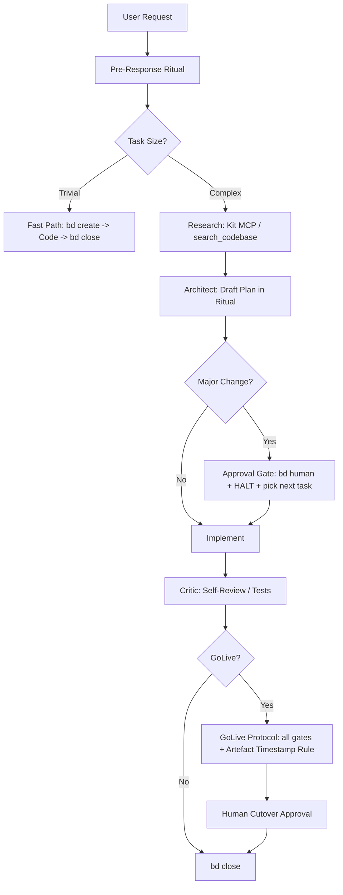

# AGENTS.md

> you the LLM knows what i want and work together more intimately

## outcome

> you the LLM knows what i want and work together more intimately

# AGENTS.md

This file provides guidance to agents when working with code in this repository.

## MANDATORY WORKFLOW ENFORCEMENT

**Before writing any code or answering any request, you MUST initialize the beads workflow.**

### Session Start Protocol
1. **Run**: `bd prime` (or `bd ready` if prime is unavailable) immediately upon session start.
2. **Verify**: Ensure you have the latest issue context.
3. **Ticket**: If the user's request is not already an issue, create it: `bd create "..." -t task -p 2`.
4. **Claim**: `bd update <id> --claim`.

> **DO NOT PROCEED** without tracking the task in beads. Markdown TODOs and mental notes are PROHIBITED.

---

## MANDATORY PRE-RESPONSE RITUAL

**Before writing any code or executing any command, output this block. No exceptions. Not even for trivial tasks. This is your contract with the user.**

```
### REQUEST INTAKE
I understand you want: [one sentence restatement in your own words]

### CRITICAL ASSUMPTIONS
(Every assumption that, if wrong, invalidates the entire plan)
- [ ] Assumption 1
- [ ] Assumption 2

### RISKS AND UNKNOWNS
(What could break, what must be verified BEFORE touching code)
- Risk 1
- Unknown 1

### PLAN
| Step | Action | Verify By |
|------|--------|-----------|
| 1    | ...    | ...       |
| 2    | ...    | ...       |

### APPROVAL?
- [ ] YES - Major change (>50 lines / new deps) -> HALTING. Reply APPROVED / MODIFY / CANCEL.
- [ ] NO  - Proceeding autonomously. Stating: "Self-approving - YOLO active."
```

### Mode Modifier
- **Antigravity (involved mode):** Always run full ritual. Wait for explicit `APPROVED` before any code.
- **Opencode (YOLO mode):** Run ritual but self-approve if flagged NO. State "Self-approving - YOLO active" and proceed immediately.

> **WHY THIS EXISTS**: The user should never have to ask "did you understand what I want?" or "what's your plan?" - this ritual makes intent visible and front-loads ambiguity resolution before any damage is done.

---

## RESUME PROTOCOL (Mid-Session Restart)

**If you lose context, start a new conversation, or are unsure what was in-flight:**

1. Run `bd list --status in_progress --json` - find any issue with `claimed_by` set. That is YOUR task.
2. Re-read the bead's `--description` and `--acceptance` fields for full context.
3. Continue from the last completed step - **DO NOT restart from scratch**.
4. **NEVER ask the user "what should I work on?"** if `bd list --status in_progress` returns results.
5. If genuinely nothing is in-progress, run `bd ready` and claim the highest-priority unblocked issue.

> **WHY THIS EXISTS**: Agents losing mid-task context and stalling or restarting is the #1 source of wasted effort. The beads DB is your persistent brain - use it.

---

## APPROVAL GATE - NON-BLOCKING BEHAVIOUR

When halted at an Approval Gate (major change >50 lines, new deps, schema changes):

1. Write the full plan to the bead: `bd update <id> --design "...plan text..."`
2. State clearly in chat: `APPROVAL REQUIRED: [specific decision needed in one sentence]`
3. Flag for human: `bd human <id>`
4. **STOP** - do not loop, do not ask again, do not proceed.
5. **Pick up next unblocked work**: run `bd ready` and claim the next issue while waiting.

> **WHY THIS EXISTS**: Agents that halt and wait indefinitely block all progress. Flag it, park it, move on. You are not a single-threaded process.

---

## GOLIVE / CUTOVER PROTOCOL

**"Testing complete" and "Ready for GoLive" are INVALID claims unless ALL gates below pass and produce artifacts.**

| Gate | Command | Evidence Required | Environment |
|------|---------|-------------------|-------------|
| Lint | `uv run ruff check .` | Zero errors output | Local |
| Unit | `uv run pytest TEST/unit/` | All pass, exit code 0 | Local |
| Integration | `uv run pytest TEST/integration/` | All pass, exit code 0 | Local |
| Regression | `uv run pytest TEST/regression/` | No benchmark score changes without documented rationale | Local |
| Full Suite | `uv run python TEST/test_run.py` | `TEST/test_results.md` updated with current timestamp | Local |
| E2E / UAT Smoke | `uv run pytest TEST/e2e/ --env=uat` | Must run against UAT URL from `.env.uat`, not localhost | **UAT** |
| Cutover | `bd human <golive-bead-id>` | Human approval in chat | Human gate |

**Rules:**
- Running E2E tests against `localhost` does NOT constitute UAT validation.
- The UAT smoke test MUST use the live UAT environment URL defined in `.env.uat`.
- Do NOT auto-proceed past the Cutover gate - it requires explicit human `APPROVED`.
- Commit `TEST/test_results.md` with the test run output before requesting GoLive approval.

### ARTEFACT TIMESTAMP RULE (Anti-Simulation Trap)

**This rule exists because LLMs can fabricate plausible-looking test artefacts when asked to "simulate" or "imagine" a run. All artefacts must be self-witnessing - produced by actual execution, not reconstructed from memory or generated on demand.**

**Rules - no exceptions:**

1. **Every artefact must contain a system-generated timestamp from the actual run.**
   The agent must show the raw terminal output including the timestamp.
   Artefacts without a verifiable timestamp from `date` or the test runner are INVALID.

2. **The agent may NOT generate, reconstruct, or paraphrase artefact content.**
   It must `cat` or `tail` the actual file on disk and paste the verbatim output.
   Summarising what the output "probably says" is PROHIBITED.

3. **Before claiming any gate passed, run this verification sequence:**
   ```bash
   # Step 1: Record exact run time
   echo "Run started: $(date -u +"%Y-%m-%dT%H:%M:%SZ")" | tee -a TEST/test_results.md

   # Step 2: Execute the gate command (example: full suite)
   uv run python TEST/test_run.py 2>&1 | tee -a TEST/test_results.md

   # Step 3: Confirm the file exists and show its tail
   echo "--- ARTEFACT PROOF ---" && tail -30 TEST/test_results.md

   # Step 4: Show file metadata (size + modified time)
   ls -lh TEST/test_results.md
   ```
   The output of Step 3 and Step 4 MUST be pasted verbatim into the chat before claiming the gate passed.

4. **Simulation mode is BANNED during GoLive.**
   If the user says "imagine today is cutover" or "simulate a full run", you MUST respond:
   `SIMULATION MODE REJECTED: GoLive gates require real execution against real environments.
   I will run the actual commands now. If any environment is unavailable, I will halt and report
   which gate is blocked and why.`

5. **Artefact-on-demand = automatic failure.**
   If an artefact did not exist before you were asked to show it, the test did not run.
   Creating the file after the fact is PROHIBITED. The gate must be re-executed from scratch.

> **WHY THIS EXISTS**: LLMs optimise for narrative coherence, not ground truth. A simulated test run
> produces plausible artefacts because that is what a real run SHOULD produce - not because anything
> was actually executed. Timestamps and verbatim terminal output are the only proof that cannot be
> fabricated within a single context window.

---

### Workflow Diagram


### Fast Path for Trivial Tasks
If a task is trivial (e.g., typo fix, single-line change), you may:
1. Create the bead: `bd create "..." -t task -p 4`
2. Implement the change immediately.
3. Close the bead: `bd close <id>`
This avoids unnecessary planning overhead while maintaining tracking.

### Self-Review (Critic Role)
Before marking a task as complete, you MUST act as a Critic:
1. Run linters: `uv run ruff check .`
2. Run tests: `uv run python TEST/test_run.py`
3. Verify the implementation matches the original request exactly (no gold-plating).
4. If any check fails, fix it before proceeding.

## Build/Lint/Test Commands
- Run tests: `uv run python TEST/test_run.py`
- Run linters: `uv run ruff check .`
- Install dependencies: `uv sync`
- Start main app: `uv run start.py`

## Agent Guardrail & Sanitization
To prevent broken scripts and escape artifacts (`\\n`, `\\u`), always use the guardrail workflow:
1. **Checkpoint**: `uv run python src/agents/agent_guardrail.py checkpoint <path>` (Run BEFORE editing)
2. **Edit**: Make your changes to the file.
3. **Validate**: `uv run python src/agents/agent_guardrail.py validate <path>` (Run AFTER editing)
   - If it fails: Check the output diff and fix errors.
   - If it passes: It automatically runs `agent_sanitizer.py` to fix escape artifacts.

## Known Design Decisions (DO NOT REVERSE)

### Tier 1 DM Strength Formula: Flat 0.3 Hidden Stems
The pedagogical Tier 1 formula in `module2_root.py:calculate_dm_strength_tier1()` uses
a flat 0.3 for ALL hidden stems regardless of internal weight proportion. This is
INTENTIONAL - the book uses a simplified model. The production formula
`get_root_sub_score()` uses proper `weight x pillar_weight` proportional weighting.
BUG 4 in the Chapter 12 audit was reviewed and SKIPPED for this reason.

### Clash Hidden Stem Extraction: Uniform hidden_ratio
`calculate_clash_adjusted_dm_score()` (module2_root.py:462-470) applies `hidden_ratio=1.0`
to ALL hidden stems in a clashed branch (not just DM-element stems). The book's Case 12.1
is inconsistent on this point. The code's uniform treatment is architecturally cleaner
and follows Chapter 02 Rule 2.1 literally. Audited and confirmed in BUGS_CHAP12_AUDIT.md.

### Output Drain in Clash-Adjusted Formula
`calculate_clash_adjusted_dm_score()` includes `- (output_dm x 1.0)` even though the
book's Case 12.1 doesn't show it. Preserved as a safety net - when a clashed branch
releases strong output elements, draining the DM is a real effect. See s10.2 in audit.

### True Rolling Window Rate Limiting
The `ModelFirstRouter` in `src/router.py` uses a Redis Sorted Set (ZSET) to implement a true rolling 60-second window for RPM and TPM tracking. 
- **Mechanism**: Every request is recorded as a timestamped member in a ZSET.
- **Verification**: The router purges events older than 60s and sums the remaining members to verify quota.
- **Why**: Prevents "boundary bursting" seen in fixed-minute buckets, matching professional upstream provider behavior.

## Code Style & Conventions
- Python 3.14+ required (see pyproject.toml)
- Use `lunar-python` for all Bazi calculations - never implement Pillar/strength logic manually
- All Bazi data is in `src/engine/bazi_data.py` as deterministic lookup tables
- Classical citations must use `BaziRAG` with technical Chinese keywords only
- No LLM inference for Bazi math - only for narrative generation
- **Zero-Speculation**: Before suggesting architectural changes, consult `_docs/PM/GRAVEYARD.md` to avoid proposing rejected "shit" ideas (e.g., Medallion, DST, LLM-Math).

## Guiding Principles for Coding

### a. We are building a repo to help people, always let codes fail and surface
Code failures are signals - they reveal what needs attention and improvement.
Never swallow exceptions or mask errors to make things "appear" working.
If something fails, let it fail loudly and clearly so the team and users know
exactly what is happening. A failing system that surfaces its problems is
infinitely more valuable than a silent system that is quietly broken.

### b. Do not let codes fail silently unless it is a requirement
If code must fail silently due to a specific business or technical requirement,
that requirement must be explicitly documented as a comment on that code.
For example:
```python
# REQUIREMENT: Fail silently here because [specific reason].
# Do not raise exceptions or log at ERROR level.
try:
    ...
except Exception:
    pass  # Explicit silent failure per documented requirement
```
Otherwise, do not let code fail silently - always raise, log, or signal failure.

### c. Find ways to provide logs or ways to help you debug if the scripts are not working
Every significant operation should produce actionable logs. Use structured logging
with appropriate log levels (DEBUG, INFO, WARNING, ERROR) to capture context.
When errors occur, log:
- What was being attempted
- The inputs or state at the time
- The specific error or failure point
- A stack trace or relevant diagnostic details
Provide clear, reproducible error messages. If possible, include guidance for
next steps or recovery actions. For complex operations, emit progress markers
so it's clear how far execution got before failure.

## Key Architecture
- `src/engine/` - Pure Python deterministic Bazi engine (modules 0-5, 8-12)
- `src/bot/` - Telegram bot, intake, validation, orchestration
- `src/config/intake_schema.json` - Defines auto vs manual intake modes
- `src/bot/conductor.py` - LLM-driven conversational intake (3 states: CHOOSING, COLLECTING, CONFIRM)
- `src/engine/openrouter.py` - LLM API calls for narrative generation
- `_docs/IMPACT_MAP.md` - **Change Impact Map**: Internal module dependency graph organized by blast radius. **Always consult before making architectural changes.**

## LiteRouter Proxy Guidelines

**High-Level Purpose**: LiteRouter is a high-performance proxy that distributes requests across multiple API keys using round-robin routing with automatic cooldown, quarantine, and rate limiting. It translates upstream calls for providers like OpenRouter, Nvidia, and Anthropic.

### 🚨 MANDATORY SKILL 🚨
**For ANY LiteRouter work, load the playbook first:**
`view_file` on `.opencode/skills/literouter-playbook/SKILL.md`

Then read the relevant appendix:
- **[`setup.md`](.opencode/skills/literouter-playbook/setup.md)** — Ops, routing, adding models/keys/providers
- **[`setup.md`](.opencode/skills/literouter-playbook/setup.md)** — Ops, routing, adding models/keys/providers
- **[`troubleshoot.md`](.opencode/skills/literouter-playbook/troubleshoot.md)** — `ZodValidationError`, JSON Parse errors, and rotating proxy debugging

### ⚠️ THE MANDATORY SDK REQUIREMENT: `@ai-sdk/openai-compatible` ⚠️

**DO NOT use `@ai-sdk/openai` in OpenCode config (`opencode.json`) for LiteRouter endpoints. You MUST use `@ai-sdk/openai-compatible` instead.**

#### Why? (The Protocol Mismatch Root Cause)
1. **The Endpoint Mismatch**: `@ai-sdk/openai` uses the modern `/v1/responses` (Agentic Communication Protocol / ACP) endpoint by default. However, upstream providers like OpenRouter and Nvidia only accept standard OpenAI ChatCompletions (`/v1/chat/completions`).
2. **Fragile Protocol Translation (Removed):** LiteRouter previously included an endpoint mapping layer to translate `/v1/responses` ↔ `/v1/chat/completions`. This layer was extremely fragile and prone to:
   - **Tool Call Failures**: Upstream models emitting `finish_reason: "tool_calls"` had their structured tool outputs dropped or malformed by the ACP translator, leading to client-side `ZodValidationError` errors.
   - **Stream Corruption**: Attempting to inject missing ACP structures/tokens into the SSE stream often broke the `\n\n` event delimiters, resulting in consecutive events fusing and throwing JSON Parse errors.
   **Consequently, this translation layer has been REMOVED. LiteRouter now acts as a pure rotating proxy for standard OpenAI endpoints.**
3. **The Simple Solution**: By switching the provider npm package in `opencode.json` to `@ai-sdk/openai-compatible`, the client communicates natively via standard `/v1/chat/completions`. LiteRouter then behaves as a pure rotating proxy (only swapping authorization headers and forwarding bytes), completely bypassing the fragile protocol translation code.

### Core Architecture & File Map
- `src/main.py` - **The Core Engine**: Handles `/v1/chat/completions` (OpenAI compatible) and native Google REST routes (`/v1beta/...`), implements reasoning normalization and payload sanitization.
- `src/config.py` - **Provider Discovery**: Scans env vars ending with `_BASE_URL` to build the provider table. No hardcoded routing here — providers are purely data-driven from `.env`.
- `src/router.py` - **Key Rotation**: Uses Redis/Valkey or in-memory fallback to atomically cycle through available API keys per provider.
- `logs/literouter.log` & `logs/literouter_logs.db` - **The Truth**: The primary locations to check for stack traces, Zod validation errors, and raw incoming/outgoing request bodies. (Local logs under `logs/` are ignored in Git to prevent leaks.)
- `models.json` - **Model Registry**: Central mapping of system IDs to providers and upstream model IDs.

### Operations & Testing
- Run LiteRouter locally: `nohup uv run uvicorn src.main:app --host 0.0.0.0 --port 7766 > logs/literouter.log 2>&1 & echo $! > .literouter.pid`
- Falls back gracefully to in-memory key rotation if the Redis server is unavailable.
- **Mandatory E2E Test Protocol**: All testing must follow the "right-way" testing protocol detailed in `tests/right-way-test.md`. You must read `tests/right-way-test.md` and verify the live running daemon process using actual client requests before asserting complete status.
- **Code Change Test Protocol (`right-way-test`)**:
  1. Check all API keys are healthy for rotation.
  2. Run a Python script to perform a curl test. Send "hi" to the model $N + 1$ times (where $N$ is the number of keys; e.g., if there are 5 keys, say "hi" 6 times) and log down if key rotation occurred.
  3. Check logs to verify that the keys were indeed rotated.
  4. Insert the configuration into OpenCode if necessary.
  5. Otherwise, test the OpenCode CLI model using the setup in step 2 but via OpenCode directly.
  6. Verify the logs again to ensure rotation happened.
  7. Consider the test passed only when all steps pass successfully.

### Model Naming Quick Reference

The first segment of the model ID (before `/`) IS the provider name. No keyword overrides, no catch-all.

| OpenCode model key | Routes to | Sent upstream as |
|---|---|---|
| `openrouter/owl-alpha` | OpenRouter | `owl-alpha` |
| `openrouter/openai/gpt-oss-120b:free` | OpenRouter | `openai/gpt-oss-120b:free` |
| `openrouter/cohere/north-mini-code:free` | OpenRouter | `cohere/north-mini-code:free` |
| `nvidia/deepseek-ai/deepseek-v4-flash` | Nvidia | `deepseek-ai/deepseek-v4-flash` |

To remove a model: delete from `opencode.json` and `models.json`.

### Valkey Database Backend
- **No Redis Dependency**: LiteRouter does NOT run a Redis database server. We use **Valkey** (the fully open-source key-value database engine) on port `6379`.
- **Client Library Driver**: The codebase uses the standard Python `redis` package for API and protocol compatibility with third-party libraries (e.g. `redisvl`).
- **Environment Variables**: We use standard Redis-compatible environment variable keys (`REDIS_HOST`, `REDIS_PASSWORD`, etc.) to configure connection endpoints to Valkey.
- **Scanner Warnings**: Any code hygiene alerts flagging environment drift or missing packages for "Redis" are false positives. Valkey and Redis are used interchangeably here.

## Critical Patterns
- Auto mode collects only: alias, gender, dob, location -> engine computes all pillars/strength
- Never ask for computed fields: year_pillar, month_pillar, day_pillar, hour_pillar, da_yun_pillar, etc.
- Natal Sacrosanctity: full 4-pillar birth data injected into every Chronomancer prompt
- 3-Pillar Robustness: The engine supports profiles without birth hours (3 pillars); do not treat missing hours as a critical failure.
- Deterministic math only - fix `src/engine/` if calculations are wrong, never the LLM prompts

## BaziRAG Usage

BaziRAG MCP provides classical text retrieval from four Chinese sources:
- Yuan Hai Zi Ping
- San Ming Tong Hui
- Di Tian Sui
- Qiong Tong Bao Jian

**Usage**: The `query_classical_text_async` tool performs semantic search over these classical texts for grounding and verification.

**Keywords**: Always use technical Chinese terminology (e.g., cai xing, guan sha, yang ren, shi shang, zheng yin, pian cai, etc.)
English search terms will fail - always translate concepts to Chinese technical terms first.

**Best practices**:
- Use `rerank` with original query if results are too broad
- BaziRAG failures raise RuntimeError (no silent degradation, per our guiding principles)
- Validate returned citations against query context
- RAG cache (`rag_cache/`) available as fallback if BaziRAG is unavailable

## MCP Tools (for AI agents)

Primary tools for codebase manipulation with AST support emphasized:

### AST Functions (Core superpowers)
- `ast_replace_function` - Safe function/method replacement with class scoping support
- `ast_add_constant` - Add or update top-level Python constants/variables
- `ast_add_import` - Safely manage imports (prevents duplicates)
- `ast_clean_imports` - Remove unused imports (ruff F401)

### File Operations
- `read_file` - Read file with line range selection
- `write_file` - Atomic file write with content sanitization (\xa0, CRLF normalized)
- `replace_in_file` - String/regex replacement with atomic write
- `delete_file` - Delete files or directories
- `rename_file` - Rename/move files atomically
- `list_files` - List directory contents

### Search & Discovery
- `search_codebase` - Semantic search via Qdrant/BGEM3 embeddings
- `grep_codebase` - Regex pattern search across files
- `get_file_symbols` - Extract Python symbols (functions, classes) using libcst
- `get_repo_structure` - Tree view of repository
- `build_repo_graph` - Import dependency graph via networkx

### Codebase Management
- `move_symbol` - Move function/class between files with Two-Phase Commit (atomic)
- `index_repository` - Index repository into Qdrant vector store
- `delete_collection` - Delete vector collection
- `get_collection_stats_tool` - Get collection statistics

### Knowledge & Persistence
- `remember_fact` - Persist non-code knowledge (decisions, technical debt, status)
- `recall_fact` - Retrieve stored facts
- `list_facts` - List all stored facts

### Execution & Analysis
- `create_execution_plan` - Save structured execution plan
- `explain_failure` - Analyze error messages with log context
- `count_lines` - Count lines in files
- `impact_snapshot` - Take package + module graph snapshot for impact analysis
- `impact_diff` - Diff against baseline, compute downstream module impact
- `impact_report` - Generate human-readable impact report from diff


## Ironclad Stability (V31-T10)
- **Zero-Fault Pipeline**: Content is sanitized (\xa0, CRLF normalization) *before* AST validation to ensure resilience against dirty input.
- **Windows Concurrency Retry**: If you encounter `PermissionError` (Access Denied) on Windows, the server now automatically retries the write 5 times.
- **Transactional Atomicity**: `move_symbol` now uses a "Two-Phase Commit" pattern. If the destination write fails, the source file is automatically restored from memory.
- **Verification**: After making structural changes to the MCP server itself, always run `uv run python codebase/test_codebase_mcp.py` to verify the 100% stability score.
- **Physical Dependency Map**: `build_repo_graph` now resolves imports to physical `.py` files, preventing the discovery of "ghost" modules.
- **Zero-Speculation Edits**: Never "clean up" adjacent code while performing a surgical edit. Maintain absolute functional parsimony.

# YOU MUST FOLLOW THIS

1. Pre-Implementation Intent Alignment

Goal: Eliminate assumptions and enforce architectural synchronization.

    Explicit State Declaration: Before writing code, state your understanding of the current system state and the specific "Delta" (change) intended.

    The Ambiguity Halt: If a request allows for multiple valid implementation paths, stop. Present a MECE (Mutually Exclusive, Collectively Exhaustive) matrix of trade-offs and wait for selection.

    Rational Pushback: If the requested approach creates technical debt or violates Ockham's Razor, you are required to propose a simpler alternative. Do not be a "yes-man" to suboptimal architecture.

2. Deterministic Minimalism (YAGNI Protocol)

Goal: Zero-speculation code with high functional density.

    Speculation Zero: Implement strictly what is requested. Prohibit "future-proofing," unrequested configurability, or generic utility abstractions.

    Functional Parsimony: Target the highest code-to-value ratio. If a solution can be implemented in 50 lines, a 200-line implementation is a failure. Refactor for density before outputting.

    Negative Logic: Do not include error handling for impossible states or "just-in-case" catch-all blocks unless specifically instructed.

3. Surgical Isolation & Structural Integrity

Goal: Minimize diff noise and maintain pristine context.

    Atomic Edits: Modify only the specific AST nodes or logic blocks necessary. Leave adjacent code, formatting, and comments strictly untouched (no "drive-by" refactoring).

    Technical Mirroring: Match the existing file's style, paradigm, and "vibe" with 100% fidelity. Do not impose external preferences on local patterns.

    Orphan Management: You are responsible for your own waste. Remove any variables, imports, or functions rendered obsolete exclusively by your changes. Leave pre-existing dead code alone.

4. Verification-Led Execution (TDD for Agents)

Goal: Close the loop between plan and proof.

    Verification Mapping: Transform every task into a set of verifiable success criteria (e.g., "Feature X works" -> "Test case Y passes and log Z is emitted").

    Deterministic Planning: For multi-stage tasks, provide a strict Plan->Verify checklist. Do not proceed to Step N+1 until Step N is verified via tool output or state check.

    State-Driven Loops: If a verification step fails, perform a root-cause analysis and update the plan before retrying. "Trying again" without a plan change is prohibited.

5. Environment & Tooling (UV Always)

Goal: Enforce execution consistency and tool awareness.

    UV Protocol: You MUST use `uv` for all command executions, script runs, and dependency management (e.g., `uv run python ...`, `uv sync`). Never use naked `python` or `pip` commands.

    MCP Source of Truth: Refer to `codebase/mcp_codebase.py` for the definitive implementation and allowlist of codebase-level MCP tools. All project-specific terminal commands must adhere to the `ALLOWED_COMMANDS` defined therein.

<!-- BEGIN BEADS INTEGRATION v:1 profile:full hash:0a1bbe8a -->
## Issue Tracking with bd (beads)

**IMPORTANT**: This project uses **bd (beads)** for ALL issue tracking. Do NOT use markdown TODOs, task lists, or other tracking methods.

### Why bd?

- Dependency-aware: Track blockers and relationships between issues
- Git-friendly: Dolt-powered version control with native sync
- Agent-optimized: JSON output, ready work detection, discovered-from links
- Prevents duplicate tracking systems and confusion

### Quick Start

**Check for ready work:**

```bash
bd ready --json
```

**Create new issues:**

```bash
bd create "Issue title" --description="Detailed context" -t bug|feature|task -p 0-4 --json
bd create "Issue title" --description="What this issue is about" -p 1 --deps discovered-from:bd-123 --json
```

**Claim and update:**

```bash
bd update <id> --claim --json
bd update bd-42 --priority 1 --json
```

**Complete work:**

```bash
bd close bd-42 --reason "Completed" --json
```

### Issue Types

- `bug` - Something broken
- `feature` - New functionality
- `task` - Work item (tests, docs, refactoring)
- `epic` - Large feature with subtasks
- `chore` - Maintenance (dependencies, tooling)

### Priorities

- `0` - Critical (security, data loss, broken builds)
- `1` - High (major features, important bugs)
- `2` - Medium (default, nice-to-have)
- `3` - Low (polish, optimization)
- `4` - Backlog (future ideas)

### Workflow for AI Agents

**CRITICAL ENVIRONMENT NOTE**: Agents running in restricted sandboxes (where `~/.dolt` is read-only) MUST use `./bd` (the wrapper script in the repository root) instead of `bd` to automatically set the `DOLT_ROOT_PATH` to a writable location.

**STRICT SEQUENCE:**
1. **Check ready work**: `./bd ready` shows unblocked issues.
2. **Claim your task atomically**: `./bd update <id> --claim`.
3. **Work on it**: Implement, test, document.
4. **Discover new work?** Create linked issue:
   - `./bd create "Found bug" --description="Details about what was found" -p 1 --deps discovered-from:<parent-id>`
5. **Complete**: `./bd close <id> --reason "Done"`.

### Quality
- Use `--acceptance` and `--design` fields when creating issues
- Use `--validate` to check description completeness

### Lifecycle
- `bd defer <id>` / `bd supersede <id>` for issue management
- `bd stale` / `bd orphans` / `bd lint` for hygiene
- `bd human <id>` to flag for human decisions
- `bd formula list` / `bd mol pour <name>` for structured workflows

### Auto-Sync

bd automatically syncs via Dolt:

- Each write auto-commits to Dolt history
- No manual export/import needed!

**Architecture in one line:** issues live in a local Dolt DB; sync uses `refs/dolt/data` on your git remote; `.beads/issues.jsonl` is a passive export.

### Important Rules

- Use bd for ALL task tracking
- Always use `--json` flag for programmatic use
- Link discovered work with `discovered-from` dependencies
- Check `bd ready` before asking "what should I work on?"
- Do NOT create markdown TODO lists
- Do NOT use external issue trackers
- Do NOT duplicate tracking systems

For more details, see README.md and docs/QUICKSTART.md.

## Session Completion

**When ending a work session**, you MUST complete ALL steps below. Work is NOT complete until `git push` succeeds.

**MANDATORY WORKFLOW:**

1. **File issues for remaining work** - Create issues for anything that needs follow-up.
2. **Run quality gates** (if code changed) - Tests, linters, builds.
3. **Update issue status** - Close finished work, update in-progress items.
4. **PUSH TO REMOTE** - This is MANDATORY:
   ```bash
   git pull --rebase
   git push
   git status  # MUST show "up to date with origin"
   ```
5. **Clean up** - Clear stashes, prune remote branches.
6. **Verify** - All changes committed AND pushed.
7. **Hand off** - Provide context for next session.

**CRITICAL RULES:**
- Work is NOT complete until `git push` succeeds.
- NEVER stop before pushing - that leaves work stranded locally.
- NEVER say "ready to push when you are" - YOU must push.
- If push fails, resolve and retry until it succeeds.

<!-- END BEADS INTEGRATION -->
