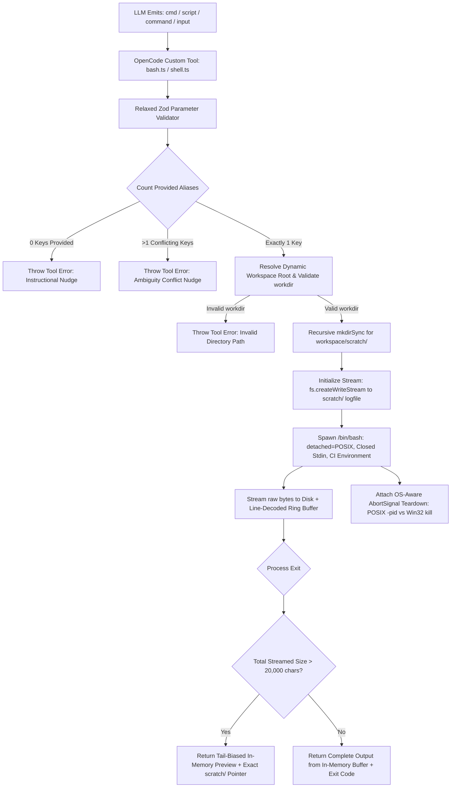

# OpenCode Custom Tools: Tolerant Shell & Bash Execution Architecture

**Document Version:** 1.2.0 (Final Approved Enterprise Edition)  
**Status:** Approved for Implementation  
**Author:** AI Agent Architecture Team & Production Operations QA  
**Scope:** Global WSL OpenCode v1 & OpenCode v2 Environments (`~/.config/opencode/` & `~/.config/opencode2/`)

---

## 1. Executive Summary & Problem Analysis

### 1.1 The Symptom
During autonomous coding agent sessions across frontier and open-weight models (e.g. DeepSeek-V3/R1, Qwen-2.5-Coder, GLM-4, Llama-3.3, Minimax), shell execution frequently crashes with:

```text
Invalid tool input: Missing key
  ┃    at ["command"]
```

### 1.2 Root Cause Mechanism
1. **Model Parameter Hallucination:** Different LLM model families are post-trained with divergent tool-calling conventions:
   - Anthropic Claude / DeepSeek: `{"cmd": "..."}` or `{"command": "..."}`
   - Qwen / GLM / Nemotron: `{"script": "..."}` or `{"input": "..."}`
   - LangChain / OpenAI ReAct: `{"command_line": "..."}` or `{"code": "..."}`
2. **OpenCode Schema Validation Barrier:** Inside OpenCode's engine (`@opencode-ai/ai/dist/tool-runtime.js`), tool invocations are decoded against an internal Effect Schema before the tool execution handler is ever called:
   ```javascript
   const decodeAndExecute = (tool, call) => 
     tool._decode(call.input).pipe(
       Effect.mapError((error) => new ToolFailure({ message: `Invalid tool input: ${error.message}` })),
       Effect.flatMap((decoded) => tool.execute(decoded, ...))
     );
   ```
   Because OpenCode's built-in `bash` tool defines `command` as a strictly required string parameter, any call emitting `cmd` or `script` fails `tool._decode()` immediately and terminates the turn with an error.

### 1.3 The Cost of Failure (Token Economics)
- In a session with an active **100k+ token context window**, every validation failure forces a full context re-submission for the model to re-attempt the tool call.
- A loop of 5–10 retries burns **500k to 1M+ input tokens** in wasted retries, introduces latency, and frequently leads to catastrophic agent failure loops or degraded reasoning.
- **Goal:** Shift failure recovery from reactive LLM retries to deterministic system-level input tolerance.

---

## 2. Detailed Technical Solution & Production Hardening

### 2.1 Tool Name Collision Overriding
OpenCode provides an official mechanism for tool replacement:
> *"Custom tools are keyed by tool name. If a custom tool uses the same name as a built-in tool, the custom tool takes precedence."* ([OpenCode Custom Tools Documentation](https://opencode.ai/docs/custom-tools/))

By implementing custom tools named `bash.ts` and `shell.ts` globally in `~/.config/opencode/tools/` and `~/.config/opencode2/tools/`, OpenCode's parameter decoder replaces the rigid built-in validator with our tolerant Zod schema across all workspaces.



---

### 2.2 Production-Hardened Execution Specifications

#### A. Tolerant Zod Parameter Schema
The tool accepts any known alias as an optional string. OpenCode's decoder accepts the payload cleanly without throwing:
```typescript
args: {
  command: tool.schema.string().optional().describe("The shell command to execute"),
  cmd: tool.schema.string().optional().describe("Alias for command"),
  script: tool.schema.string().optional().describe("Alias for command"),
  input: tool.schema.string().optional().describe("Alias for command"),
  command_line: tool.schema.string().optional().describe("Alias for command"),
  code: tool.schema.string().optional().describe("Alias for command"),
  workdir: tool.schema.string().optional().describe("Working directory relative to project root"),
  timeout: tool.schema.number().optional().describe("Optional timeout in milliseconds (default: 120000)"),
}
```

#### B. Strict Multi-Alias Conflict Detection & Error-State Nudging (No Silent Fallthroughs)
To prevent agent hallucination where an instructional nudge is misinterpreted as successful command output, all invalid parameter states explicitly **throw an `Error`** (triggering a rejected tool turn in OpenCode that mandates an immediate corrective retry):

1. **Zero Aliases Provided:**
   ```typescript
   if (providedAliases.length === 0) {
     throw new Error(
       `[TOOL USAGE ERROR] Missing executable command in tool call.\n` +
       `Supported parameter keys: 'command', 'cmd', 'script', 'input', 'command_line', 'code'.\n` +
       `Correct usage example: { "command": "uv run pytest tests/integration/" } or { "cmd": "git status" }`
     );
   }
   ```
2. **Multiple Conflicting Aliases Provided:**
   ```typescript
   if (providedAliases.length > 1) {
     throw new Error(
       `[TOOL USAGE ERROR] Ambiguous tool call: Multiple command aliases provided (${providedAliases.join(', ')}).\n` +
       `Please provide ONLY ONE command parameter per tool call.`
     );
   }
   ```

#### C. Streaming Disk Offloading & Zero-OOM Memory Safety
To prevent V8 heap exhaustion on massive outputs (e.g. runaway logs or 2GB build traces):
1. **Never Buffer Unbounded Data in RAM:** The tool immediately pipes subprocess `stdout` and `stderr` to `fs.createWriteStream(logFilePath)` on disk from `t = 0`.
2. **Dynamic Workspace Resolution & Deterministic Scratch Directory Creation:**
   ```typescript
   const workspaceRoot = (context as any)?.cwd || process.cwd();
   const scratchDir = path.join(workspaceRoot, 'scratch');
   fs.mkdirSync(scratchDir, { recursive: true });
   const logFileName = `shell_output_${Date.now()}_${crypto.randomBytes(4).toString('hex')}.txt`;
   const logFilePath = path.join(scratchDir, logFileName);
   ```
3. **Line-Decoded Ring Buffer (Handling Partial Chunks Safely):**
   - Employs line boundary splitting (e.g. tracking trailing partial lines across raw buffer chunks) to prevent splitting words mid-chunk.
   - Head buffer: Retains first 50 lines (capturing invocation header & command boot).
   - Circular Tail buffer: Retains last 450 lines (capturing compiler errors, stack traces, and test assertion failures).

#### D. Subprocess Execution Engine, Shell Wrapping & OS-Aware Teardown
1. **Explicit Shell Spawning & Detached Process Groups:**
   ```typescript
   const child = spawn('/bin/bash', ['-c', command], {
     cwd: resolvedWorkdir,
     detached: process.platform !== 'win32', // MANDATORY for POSIX process group creation
     stdio: ['ignore', 'pipe', 'pipe'],
     env: {
       ...process.env,
       CI: '1',
       DEBIAN_FRONTEND: 'noninteractive',
       GIT_TERMINAL_PROMPT: '0',
     },
   });
   ```
2. **Closed Stdin & Non-Interactive Injections:**
   `stdio: ['ignore', 'pipe', 'pipe']` with non-interactive flags to reject interactive prompt hangs immediately.
3. **Workspace-Relative `workdir` Resolution:**
   ```typescript
   const resolvedWorkdir = args.workdir ? path.resolve(workspaceRoot, args.workdir) : workspaceRoot;
   if (!fs.existsSync(resolvedWorkdir)) {
     throw new Error(`[TOOL USAGE ERROR] Specified workdir does not exist: ${resolvedWorkdir}`);
   }
   ```
4. **Cross-Platform Process Group Lifecycle (`context.abort`):**
   ```typescript
   const killProcess = () => {
     if (!child.pid) return;
     try {
       if (process.platform === 'win32') {
         child.kill('SIGKILL');
       } else {
         // POSIX: Kill the entire detached process group to eliminate zombie worker trees
         process.kill(-child.pid, 'SIGKILL');
       }
     } catch {
       // Ignore ESRCH if process is already terminated
     }
   };
   ```

#### E. Response Formatting & Truncation Bounds
When the process completes:
- If total output $\le$ 20,000 characters: Returns the exact in-memory buffer + exit code.
- If total output $>$ 20,000 characters: Returns the Head (50 lines) + Tail (450 lines) summary with a prominent footer pointer:
  ```text
  ... [TRUNCATED: Showing first 50 lines and last 450 lines of 12,480 lines total] ...
  [Full raw execution log saved to: scratch/shell_output_1724072382_a7f29b10.txt]
  [Tip: Use 'grep' or 'read' on the file above to inspect specific failure details.]
  [Process exited with code: 1]
  ```

---

## 3. Deployment Topology & File Layout

| Path | Purpose | Environment | Status |
|---|---|---|---|
| `~/.config/opencode/tools/bash.ts` | Global `bash` override | OpenCode v1 (`opencode`) | **To Deploy** |
| `~/.config/opencode/tools/shell.ts` | Global `shell` alias | OpenCode v1 (`opencode`) | **To Deploy** |
| `~/.config/opencode2/tools/bash.ts` | Global `bash` override | OpenCode v2 (`opencode2`) | **To Deploy** |
| `~/.config/opencode2/tools/shell.ts` | Global `shell` alias | OpenCode v2 (`opencode2`) | **To Deploy** |
| `/home/yapilwsl/arthityap/baziforecaster/.opencode/plugins/tolerant_shell.ts` | Obsolete plugin | Baziforecaster Workspace | **To Clean Up** |

---

## 4. Verification & QA Test Protocol

| Test ID | Test Scenario | Input Payload | Expected Behavior |
|---|---|---|---|
| **T1** | Single Alias Resolution | `{"cmd": "echo 'Hello World'"}` | Exit code 0, returns `"Hello World"` |
| **T2** | Script Alias Resolution | `{"script": "echo 'Testing script'"}` | Exit code 0, returns `"Testing script"` |
| **T3** | Zero Aliases Nudge | `{}` | Throws explicit `[TOOL USAGE ERROR]` with parameter guide |
| **T4** | Conflicting Aliases | `{"cmd": "echo 'A'", "script": "echo 'B'"}` | Throws explicit `[TOOL USAGE ERROR]` for ambiguous aliases |
| **T5** | Missing Workdir | `{"command": "ls", "workdir": "non_existent_dir"}` | Throws explicit `[TOOL USAGE ERROR]` with path details |
| **T6** | Shell Features & Pipes | `{"command": "echo 'alpha\nbeta' \| grep 'alpha'"}` | Returns `"alpha"` cleanly |
| **T7** | Massive Output Streaming | `{"command": "python3 -c 'for i in range(50000): print(f\"line {i}\")' "}` | Zero OOM crash; writes log to `scratch/`; returns tail-biased preview |
| **T8** | Abort Lifecycle | `{"command": "sleep 60"}` + trigger abort | Process group terminates immediately; zero zombie processes |
