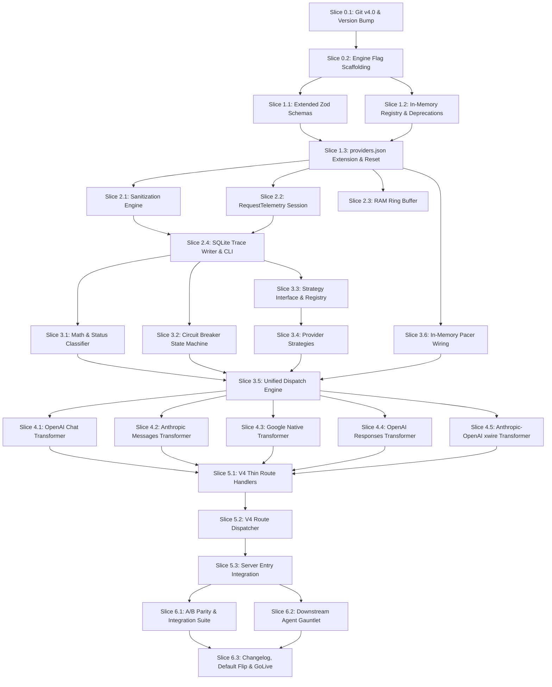

# LiteRouter v4.1 Orchestration & Deployment Plan
**Operational Workplan: Phase Slicing, Concurrency Matrix & Subagent Execution Contracts**

- **Target File**: `docs/redesign03.md`
- **Reference Architecture**: `docs/redesign02.md` (LiteRouter v4.1 Blueprint)
- **Target Release**: `v4.1.0`
- **Orchestrator Protocol**: OpenCode Deterministic Conductor (`AGENTS.md` + Orchestrator Pattern)
- **Environment**: Bun 1.x, TypeScript 5.5+, Python 3.14+ (pytest smoke tests), `bun:sqlite` (built-in)

---

## 1. Executive Summary & Orchestration Mental Model

This document specifies the exact, deterministic decomposition of the LiteRouter v4.1 architecture blueprint (`docs/redesign02.md`) into parallel executable slices.

### The Conductor Protocol
1. **The Conductor Never Edits Code Directly**: The orchestrator decomposes tasks, defines strict Definitions of Done (DoD), assigns slices to isolated subagents (`general`), verifies per-slice verification artifacts, runs consolidated quality gates, and records state via `bd remember`.
2. **Deterministic Isolation (1 Slice = 1 Work Unit)**: Slices touching the same file are strictly sequenced across batches. Slices with zero write collisions run concurrently (up to 20 subagents).
3. **Dual-Path Feature Flag**: All changes must preserve `LITEROUTER_ENGINE=legacy` (default) while enabling `LITEROUTER_ENGINE=v4` for verified parity.
4. **Zero Key Leakage & Zero Runtime Dependencies**: `.env.local` remains untouched and write-protected (`644`). Only `zod` and `bun:sqlite` are permitted.

---

## 2. Global Slicing & Concurrency Summary

| Phase | Description | Total Slices | Concurrency Model | Max Concurrency | Dependencies |
|---|---|---|---|---|---|
| **Phase 0** | Baseline, Versioning & Engine Flag Harness | **2 Slices** | Sequential / Pipelined | 1 | Git clean working tree |
| **Phase 1** | Configuration Foundation & Provider Registry | **3 Slices** | Batch 1: S1, S2 (Parallel); Batch 2: S3 (Sequential) | 2 | Phase 0 |
| **Phase 2** | Telemetry, Sanitization & Request Trace Subsystem | **4 Slices** | Parallel (Isolated files) | 4 | Phase 1 |
| **Phase 3** | Core Dispatch Engine & Provider Strategies | **6 Slices** | Batch 1: S1..S4 (Parallel); Batch 2: S5, S6 (Parallel) | 4 | Phase 2 |
| **Phase 4** | Payload Transformers (Pure Extraction) | **5 Slices** | 5 Parallel Streams (1 transformer/stream) | 5 | Phase 3 |
| **Phase 5** | V4 Route Handlers & Route Dispatcher Wire-in | **3 Slices** | Batch 1: S1, S2 (Parallel); Batch 2: S3 (Sequential wire-in) | 2 | Phase 4 |
| **Phase 6** | Comprehensive A/B Parity Validation & Benchmark Gate | **3 Slices** | Parallel verification & audit suites | 3 | Phase 5 |
| **Total** | **End-to-End Implementation** | **26 Slices** | **7 Phased Batches** | **Max 5 concurrent** | All gates verified |

---

## 3. Phase-by-Phase Slicing & Subagent Contracts

---

### Phase 0: Baseline & Safety Harness (2 Slices)

#### Slice 0.1 — Git Tagging & Package Versioning
- **Target File(s)**: `package.json`
- **Subagent Type**: `general`
- **Scope**:
  1. Create backup branch `v4.0` pointing to current HEAD.
  2. Bump `package.json` version from `4.0.0` to `4.1.0`.
- **Definition of Done (DoD)**:
  - `git branch` lists `v4.0`.
  - `package.json` reflects `"version": "4.1.0"`.
  - `bun run typecheck` exits code 0.
- **Verification Command**:
  ```bash
  git rev-parse v4.0 && grep '"version": "4.1.0"' package.json && bun run typecheck
  ```

#### Slice 0.2 — Dual-Path Engine Flag Scaffolding
- **Target File(s)**: `src/config/env.ts`, `src/index.ts`
- **Subagent Type**: `general`
- **Scope**:
  1. Add `LITEROUTER_ENGINE` to `src/config/env.ts` (type: `"legacy" | "v4"`, default: `"legacy"`).
  2. Add `LITEROUTER_ENGINE_OVERRIDE` to `env.ts` (boolean, default: `false`).
  3. Wire routing in `src/index.ts` to inspect `LITEROUTER_ENGINE`: if `"v4"` dispatch to `dispatchV4Placeholder` (initially 501 / fallthrough), else legacy handlers.
- **Definition of Done (DoD)**:
  - Default `LITEROUTER_ENGINE` evaluates to `"legacy"`.
  - `bun test` passes 100% untouched.
  - Gateway boots cleanly with `bash scripts/start.sh` and returns `200` on `GET /health`.
- **Verification Command**:
  ```bash
  bun test && bun run typecheck && curl -sk https://localhost:7766/health
  ```

---

### Phase 1: Configuration Foundation & In-Memory Registry (3 Slices)

#### Slice 1.1 — Extended Zod Schemas
- **Target File(s)**: `src/config/schema.ts`, `tests/unit/config/schema.test.ts`
- **Subagent Type**: `general`
- **Scope**:
  1. Implement `RequestRetrySchema`, `KeyCooldownSchema`, `ProviderPacerConfigSchema`, `CircuitBreakerConfigSchema`, `ConserveRuleSchema`, and `ProviderStrategySchema`.
  2. Extend `ProviderConfigEntrySchema` with optional fields & defaults ensuring 100% backwards compatibility with existing `config/providers.json`.
  3. Write exhaustive schema unit tests in `tests/unit/config/schema.test.ts` (20+ test cases covering default application and constraint violations like `max_ms < min_ms`).
- **Definition of Done (DoD)**:
  - All new schemas parse valid inputs and apply defaults.
  - Invalid bounds (`max_ms < min_ms`) fail validation.
  - Existing `config/providers.json` validates without error.
- **Verification Command**:
  ```bash
  bun test tests/unit/config/schema.test.ts && bun run typecheck
  ```

#### Slice 1.2 — In-Memory Provider Registry & Deprecation Warning System
- **Target File(s)**: `src/config/providers.ts`, `src/config/deprecation.ts`, `tests/unit/config/providers.test.ts`, `tests/unit/config/deprecation.test.ts`
- **Subagent Type**: `general`
- **Scope**:
  1. Create `src/config/providers.ts`: implement `initProviderRegistry()`, `getProviderConfig(codeOrName)`, `getProviderDisplayName(codeOrName)`, `getAllProviders()`, and atomic pointer swap guarantee.
  2. Create `src/config/deprecation.ts`: check for purged env variables and emit `console.warn` only when `LITEROUTER_ENGINE=v4`.
  3. Write unit tests for registry initialization, O(1) map resolution, atomic hot-reload fallback on invalid JSON, and deprecation checks.
- **Definition of Done (DoD)**:
  - Atomic swap keeps old registry on schema error.
  - Deprecation warnings print correctly when deprecated env vars exist.
  - 100% unit test pass rate.
- **Verification Command**:
  ```bash
  bun test tests/unit/config/providers.test.ts tests/unit/config/deprecation.test.ts && bun run typecheck
  ```

#### Slice 1.3 — Providers JSON Extension & Boot/Reset Integration
- **Target File(s)**: `config/providers.json`, `src/index.ts`
- **Subagent Type**: `general`
- **Scope**:
  1. Update `config/providers.json` with new operational parameters (`strategy`, `request_retry`, `key_cooldown`, `pacer`, `circuit_breaker`, `name`, `env_key`) for `openrouter`, `nvidia`, `google`, `zen`, and `gcp`.
  2. Wire `initProviderRegistry()` into `src/index.ts` server startup sequence (fail fast on boot failure).
  3. Wire atomic registry reload into `handleHardReset()` (`POST /reset`).
- **Definition of Done (DoD)**:
  - `config/providers.json` passes schema validation.
  - `GET /health` and `POST /reset` succeed against live server.
  - Unit tests in `tests/unit/` pass.
- **Verification Command**:
  ```bash
  bun test && bun run typecheck && bun run scripts/doctor.ts
  ```

---

### Phase 2: Standardized Telemetry & Request Trace Subsystem (4 Slices)

#### Slice 2.1 — Sanitization & Redaction Engine
- **Target File(s)**: `src/telemetry/sanitize.ts`, `tests/unit/telemetry/sanitize.test.ts`
- **Subagent Type**: `general`
- **Scope**:
  1. Implement structural header allowlisting (`ALLOWED_HEADERS`) and strict redaction (`REDACTED_HEADERS`).
  2. Implement secondary defense-in-depth regex scrubbing for API tokens (`sk-or-v1-`, `nvapi-`, `AIzaSy`, `sk-lr-`, `Bearer`) across string payloads.
  3. Provide comprehensive test matrix proving zero leakages of API keys.
- **Definition of Done (DoD)**:
  - Unknown headers are dropped entirely.
  - Authorization / x-api-key headers are sanitized to `[REDACTED]`.
  - Body token scrubber masks keys across JSON bodies.
- **Verification Command**:
  ```bash
  bun test tests/unit/telemetry/sanitize.test.ts && bun run typecheck
  ```

#### Slice 2.2 — RequestTelemetry Session Class & Logger Interop
- **Target File(s)**: `src/telemetry/session.ts`, `src/telemetry/hooks.ts`, `src/ui/logger.ts`, `tests/unit/telemetry/session.test.ts`
- **Subagent Type**: `general`
- **Scope**:
  1. Implement `RequestTelemetry` class with monotonic timing (`performance.now()`), idempotent `markTtft()`, `recordUsage()`, `rotateKey()`, `recordLimit()`, `served()`, and `toTraceMetrics()`.
  2. Implement `MetricsHook` interface with `noopMetrics` in `src/telemetry/hooks.ts`.
  3. Add `getProviderDisplayNameCompat` to `src/ui/logger.ts` to bridge registry display names with legacy logger formatting.
- **Definition of Done (DoD)**:
  - Terminal logs match existing visual formatting and emoji banners.
  - TTFT calculation is accurate and idempotent.
  - Zero raw `Date.now()` calculations required in callers.
- **Verification Command**:
  ```bash
  bun test tests/unit/telemetry/session.test.ts && bun run typecheck
  ```

#### Slice 2.3 — High-Performance RAM Ring Buffer
- **Target File(s)**: `src/telemetry/ring_buffer.ts`, `tests/unit/telemetry/ring_buffer.test.ts`
- **Subagent Type**: `general`
- **Scope**:
  1. Implement `TraceRingBuffer`: capped at 100 traces, max 32MB RAM, max 64KB per request leg.
  2. Implement FIFO eviction when buffer bounds are exceeded.
  3. Provide `get(reqId)`, `getRecent(n)`, and `getErrors(n)` queries.
- **Definition of Done (DoD)**:
  - Leg payloads over 64KB are safely truncated with `[TRUNCATED: ...]`.
  - Memory capacity strictly constrained to $\le$ 32MB under synthetic saturation.
- **Verification Command**:
  ```bash
  bun test tests/unit/telemetry/ring_buffer.test.ts && bun run typecheck
  ```

#### Slice 2.4 — Lazy SQLite Trace Writer & CLI Inspector
- **Target File(s)**: `src/telemetry/trace_writer.ts`, `scripts/trace.ts`, `tests/unit/telemetry/trace_writer.test.ts`
- **Subagent Type**: `general`
- **Scope**:
  1. Implement `TraceWriter` using `bun:sqlite` (`logs/traces.db` with WAL mode & NORMAL sync).
  2. Implement non-blocking batch flushes (30s interval or 100 items / 16MB threshold).
  3. Ensure SQLite failure is non-fatal (falls back cleanly to RAM ring buffer).
  4. Implement `scripts/trace.ts` CLI for inspecting traces by request ID, error status, or provider code.
  5. Implement 30-day retention cleanup on boot.
- **Definition of Done (DoD)**:
  - SQLite flush writes batch records reliably.
  - Process shutdown (`SIGINT`/`SIGTERM`/`beforeExit`) synchronously drains trace queue.
  - `bun run scripts/trace.ts --errors -n 5` executes without error.
- **Verification Command**:
  ```bash
  bun test tests/unit/telemetry/trace_writer.test.ts && bun run typecheck
  ```

---

### Phase 3: Core Dispatch Engine & Execution Strategies (6 Slices)

#### Slice 3.1 — Mathematical Utilities & Status Classifier
- **Target File(s)**: `src/engine/retry.ts`, `src/engine/cooldown.ts`, `src/engine/status_classify.ts`, tests in `tests/unit/engine/`
- **Subagent Type**: `general`
- **Scope**:
  1. Implement `calculateRetryDelay()` with uniform random bounded jitter `[min_ms, max_ms]`.
  2. Implement `calculateCooldownMs()` with exponential backoff, max caps, $\pm$ jitter percent, and `Retry-After` override.
  3. Implement `defaultClassifyFailure()` mapping HTTP status codes to `fail_fast`, `retry_same_target`, or `advance_target`.
- **Definition of Done (DoD)**:
  - 1000+ statistical samples prove uniform jitter distribution within configured bounds.
  - Status classification strictly matches the blueprint matrix (429 $\to$ retry; 400 $\to$ fail_fast; 500 $\to$ retry).
- **Verification Command**:
  ```bash
  bun test tests/unit/engine/retry.test.ts tests/unit/engine/cooldown.test.ts tests/unit/engine/status_classify.test.ts && bun run typecheck
  ```

#### Slice 3.2 — Circuit Breaker State Machine
- **Target File(s)**: `src/engine/circuit_breaker.ts`, `tests/unit/engine/circuit_breaker.test.ts`
- **Subagent Type**: `general`
- **Scope**:
  1. Implement full state machine: `CLOSED` $\to$ `OPEN` $\to$ `HALF_OPEN` $\to$ `CLOSED` (or `HALF_OPEN` $\to$ `OPEN`).
  2. Sliding window failure accounting (`failure_window_ms`).
  3. Probe throttling in `HALF_OPEN` (`half_open_max_probes`).
  4. Explicit exclusion of HTTP 429 from circuit breaker failure count (429 is key-specific, handled by cooldown).
- **Definition of Done (DoD)**:
  - Trips to `OPEN` on reaching failure threshold in window.
  - Rejects incoming requests with `503 Service Unavailable` and valid `Retry-After` header when `OPEN`.
  - HTTP 429 errors DO NOT increment circuit breaker failure count.
- **Verification Command**:
  ```bash
  bun test tests/unit/engine/circuit_breaker.test.ts && bun run typecheck
  ```

#### Slice 3.3 — Strategy Interface & Boot-Time Strategy Registry
- **Target File(s)**: `src/engine/strategy.ts`, `src/engine/strategy_registry.ts`, `src/engine/strategies/standard.ts`, tests in `tests/unit/engine/strategies/`
- **Subagent Type**: `general`
- **Scope**:
  1. Define `ProviderExecutionStrategy` interface (`preDispatch`, `resolveTarget`, `classifyFailure`, `buildAuthHeaders`, `injectHeaders`).
  2. Implement `StandardStrategy` (default pass-through strategy).
  3. Implement `initStrategyRegistry()` and `getStrategy(providerCode)`.
- **Definition of Done (DoD)**:
  - Unknown providers default gracefully to `StandardStrategy`.
  - Strategy registry loads and maps all active providers in `config/providers.json`.
- **Verification Command**:
  ```bash
  bun test tests/unit/engine/strategies/standard.test.ts && bun run typecheck
  ```

#### Slice 3.4 — Specialized Provider Strategies
- **Target File(s)**:
  - `src/engine/strategies/native_cascade.ts`
  - `src/engine/strategies/gcp_guarded.ts`
  - `src/engine/strategies/zen_single_flight.ts`
  - `src/engine/strategies/anthropic_direct.ts`
  - Tests in `tests/unit/engine/strategies/`
- **Subagent Type**: `general`
- **Scope**:
  1. `NativeCascadeStrategy`: model resolution via `fusion.json` native chains, sticky tier tracking, and 404 `advance_target` classification.
  2. `GcpGuardedStrategy`: pre-dispatch billing guardrail rejecting non-Gemma models with `403 Forbidden`, dual `Authorization` + `x-goog-api-key` auth.
  3. `ZenSingleFlightStrategy`: single-flight mode enforcement and dynamic `x-session-id` UUID injection.
  4. `AnthropicDirectStrategy`: `x-api-key` and `anthropic-version: 2023-06-01` header generation.
- **Definition of Done (DoD)**:
  - GCP non-Gemma requests immediately blocked with 403.
  - Native cascade resolves `gemini-flash` to active tier and advances on 404.
  - Zen injects valid UUID session ID.
- **Verification Command**:
  ```bash
  bun test tests/unit/engine/strategies/ && bun run typecheck
  ```

#### Slice 3.5 — Unified Dispatch Engine Pipeline
- **Target File(s)**: `src/engine/dispatch.ts`, `src/lifecycle/shutdown.ts`, `tests/unit/engine/dispatch.test.ts`
- **Subagent Type**: `general`
- **Scope**:
  1. Implement `executeDispatchPipeline(req: DispatchRequest)`: circuit breaker check $\to$ strategy pre-dispatch $\to$ attempt loop (pacer acquire $\to$ key select $\to$ strategy resolve $\to$ header injection & attribution merge $\to$ upstream fetch $\to$ classify response $\to$ retry with jitter).
  2. Mid-stream cutoff enforcement: once client stream byte commits, do not retry upstream on subsequent errors; terminate cleanly with `[DONE]`.
  3. Mandatory client attribution headers merged last (`HTTP-Referer`, `X-Title`, `User-Agent`).
  4. In-flight request tracking and graceful shutdown drain in `src/lifecycle/shutdown.ts`.
- **Definition of Done (DoD)**:
  - Retries use bounded jitter delay.
  - 429 triggers key rotation without tripping circuit breaker.
  - Attribution headers present on all upstream requests.
- **Verification Command**:
  ```bash
  bun test tests/unit/engine/dispatch.test.ts && bun run typecheck
  ```

#### Slice 3.6 — In-Memory Pacer Wiring Integration
- **Target File(s)**: `src/engine/pacer_adapter.ts`, `src/network/pacer.ts`, `tests/unit/engine/pacer_adapter.test.ts`
- **Subagent Type**: `general`
- **Scope**:
  1. Create adapter bridging `config/providers.json` pacer settings to existing `RequestPacer` / `FastFifoQueue`.
  2. Support per-provider dynamic `min_delay_ms`, `max_delay_ms`, `max_queue_depth`, and `max_queue_wait_ms`.
  3. Ensure zero regression on existing pacer functionality in `src/network/pacer.ts`.
- **Definition of Done (DoD)**:
  - Pacer paces requests accurately according to provider JSON configuration.
  - Abort signals correctly cancel queued tickets without resource leaks.
- **Verification Command**:
  ```bash
  bun test tests/unit/engine/pacer_adapter.test.ts && bun run typecheck
  ```

---

### Phase 4: Pure Payload Transformers Extraction (5 Slices)

*Rule: Pure extraction only. Pure functions moved to `src/transformers/`, re-exported from legacy handlers for 100% backward compatibility.*

#### Slice 4.1 — Transformer Contract & OpenAI Chat Transformer
- **Target File(s)**: `src/engine/transformer.ts`, `src/transformers/openai_chat.ts`, `tests/unit/transformers/openai_chat.test.ts`
- **Subagent Type**: `general`
- **Scope**:
  1. Define `PayloadTransformerContract` interface in `src/engine/transformer.ts`.
  2. Extract `OpenAIChatTransformer` from `src/handlers/openai_compat.ts`: `transformClientToWire`, `transformWireToClient`, `createWireToClientStream`.
  3. Re-export extracted functions in `src/handlers/openai_compat.ts`.
  4. Write comprehensive tests with static fixtures verifying streaming SSE parsing, reasoning token scrubbing, and telemetry hook calls.
- **Definition of Done (DoD)**:
  - `openai_chat.ts` implements contract with zero external handler dependencies.
  - Legacy handler continues to pass existing unit tests.
- **Verification Command**:
  ```bash
  bun test tests/unit/transformers/openai_chat.test.ts && bun test tests/unit/midstream_retry.test.ts && bun run typecheck
  ```

#### Slice 4.2 — Anthropic Messages Transformer
- **Target File(s)**: `src/transformers/anthropic_messages.ts`, `src/handlers/anthropic_compat.ts`, `tests/unit/transformers/anthropic_messages.test.ts`
- **Subagent Type**: `general`
- **Scope**:
  1. Extract pure translation functions from `src/handlers/anthropic_compat.ts` into `AnthropicMessagesTransformer`.
  2. Implement client-to-wire and wire-to-client transformations for native Anthropic Messages API.
  3. Re-export helpers from `anthropic_compat.ts` for legacy compatibility.
- **Definition of Done (DoD)**:
  - Anthropic messages, tool calls, and streaming SSE events transform accurately.
  - Legacy Anthropic handler functions pass tests unchanged.
- **Verification Command**:
  ```bash
  bun test tests/unit/transformers/anthropic_messages.test.ts && bun run typecheck
  ```

#### Slice 4.3 — Google Native Transformer
- **Target File(s)**: `src/transformers/google_native.ts`, `src/handlers/google_native.ts`, `tests/unit/transformers/google_native.test.ts`
- **Subagent Type**: `general`
- **Scope**:
  1. Extract Gemini REST body formatting and SSE chunk translation from `src/handlers/google_native.ts` into `GoogleNativeTransformer`.
  2. Re-export in `google_native.ts`.
  3. Unit test with sample Gemini REST responses and streaming tokens.
- **Definition of Done (DoD)**:
  - Generative language REST schemas translate correctly.
  - Legacy Google Native route remains 100% operational.
- **Verification Command**:
  ```bash
  bun test tests/unit/transformers/google_native.test.ts && bun run typecheck
  ```

#### Slice 4.4 — OpenAI Responses API Transformer
- **Target File(s)**: `src/transformers/openai_responses.ts`, `src/handlers/openai_original.ts`, `tests/unit/transformers/openai_responses.test.ts`
- **Subagent Type**: `general`
- **Scope**:
  1. Extract native OpenAI Responses payload transformations from `src/handlers/openai_original.ts` into `OpenAIResponsesTransformer`.
  2. Preserve thinking blocks and reasoning content without scrubbing.
  3. Re-export in `openai_original.ts`.
- **Definition of Done (DoD)**:
  - Responses API schemas pass through cleanly.
  - Legacy Responses route remains functional.
- **Verification Command**:
  ```bash
  bun test tests/unit/transformers/openai_responses.test.ts && bun run typecheck
  ```

#### Slice 4.5 — Anthropic-to-OpenAI Cross-Wire (ao) Transformer
- **Target File(s)**: `src/transformers/anthropic_openai_xwire.ts`, `tests/unit/transformers/anthropic_openai_xwire.test.ts`
- **Subagent Type**: `general`
- **Scope**:
  1. Extract cross-wire logic (`ao` wire: Anthropic client input $\to$ OpenAI upstream wire $\to$ Anthropic SSE output) into `AnthropicOpenAIXWireTransformer`.
  2. Support tool calls, image payloads, and XML extraction.
- **Definition of Done (DoD)**:
  - Bidirectional cross-wire transformation passes fixture tests.
  - Legacy cross-wire calls function identically.
- **Verification Command**:
  ```bash
  bun test tests/unit/transformers/anthropic_openai_xwire.test.ts && bun run typecheck
  ```

---

### Phase 5: V4 Thin Route Handlers & Router (3 Slices)

#### Slice 5.1 — V4 Thin Route Handlers
- **Target File(s)**:
  - `src/handlers/v4/openai_chat.ts`
  - `src/handlers/v4/anthropic_messages.ts`
  - `src/handlers/v4/google_native.ts`
  - `src/handlers/v4/openai_responses.ts`
  - `src/handlers/v4/gcp_compat.ts`
- **Subagent Type**: `general`
- **Scope**:
  1. Implement thin route handlers (< 50 lines each).
  2. Responsibilities limited strictly to: (a) parse inbound body, (b) extract directive, (c) assemble `DispatchRequest` with appropriate transformer, (d) invoke `executeDispatchPipeline()`.
  3. Zero retry loops, zero pacer acquisitions, zero raw logging, zero key rotations in handler bodies.
- **Definition of Done (DoD)**:
  - Each handler file contains $< 50$ lines of code.
  - Handlers delegate completely to `executeDispatchPipeline`.
- **Verification Command**:
  ```bash
  bun run typecheck && wc -l src/handlers/v4/*.ts
  ```

#### Slice 5.2 — V4 Route Dispatcher
- **Target File(s)**: `src/handlers/v4/router.ts`, `tests/unit/handlers/v4_router.test.ts`
- **Subagent Type**: `general`
- **Scope**:
  1. Implement `dispatchV4(req: Request, rawKey: string, reqId: string): Promise<Response>`.
  2. Route inbound requests by path (`/v1/chat/completions`, `/v1/messages`, `/v1/responses`, `/v1beta/*`) to the corresponding thin v4 handler.
  3. Register trace endpoints `GET /v1/traces/:reqId` and `GET /v1/traces`.
- **Definition of Done (DoD)**:
  - Clean dispatch to thin handlers.
  - Auth required for `/v1/traces` (returns 401 if unauthenticated).
- **Verification Command**:
  ```bash
  bun test tests/unit/handlers/v4_router.test.ts && bun run typecheck
  ```

#### Slice 5.3 — Master Route Wiring in Server Entry
- **Target File(s)**: `src/index.ts`
- **Subagent Type**: `general`
- **Scope**:
  1. Wire `dispatchV4` into `src/index.ts` behind `LITEROUTER_ENGINE === "v4"` check.
  2. Support per-request header override `X-LiteRouter-Engine` when `LITEROUTER_ENGINE_OVERRIDE=true`.
  3. Preserve legacy dispatch when `LITEROUTER_ENGINE === "legacy"`.
- **Definition of Done (DoD)**:
  - Gateway boots under both `LITEROUTER_ENGINE=legacy` and `LITEROUTER_ENGINE=v4`.
  - `curl -sk https://localhost:7766/health` returns 200 in both modes.
- **Verification Command**:
  ```bash
  bun test && bun run typecheck
  ```

---

### Phase 6: A/B Parity Validation, Benchmarks & GoLive Gate (3 Slices)

#### Slice 6.1 — A/B Parity & Integration Suite
- **Target File(s)**: `tests/integration/test_v4_ab_parity.py`, `tests/integration/test_v4_smoke.py`
- **Subagent Type**: `general`
- **Scope**:
  1. Implement automated test comparing `LITEROUTER_ENGINE=legacy` vs `LITEROUTER_ENGINE=v4` across standardized fixtures.
  2. Validate exact parity: identical response HTTP statuses, token structures, and tool call payload semantics.
  3. Validate mandatory client attribution headers on test provider mock (`127.0.0.1:8999`).
- **Definition of Done (DoD)**:
  - 100% parity across all test cases.
  - `uv run pytest tests/integration/` passes with exit code 0.
- **Verification Command**:
  ```bash
  uv run pytest tests/integration/test_v4_ab_parity.py -v
  ```

#### Slice 6.2 — Downstream Agent Gauntlet Verification
- **Target File(s)**: Diagnostic validation across target models
- **Subagent Type**: `general`
- **Scope**:
  1. Run OpenCode 2 simulation probe (`lr-zn-oa-ch-no`, model `big-pickle`).
  2. Run Claude Code simulation probe (`lr-or-cl-ms-no`, model `anthropic/claude-3.7-sonnet`).
  3. Run Pydantic AI simulation probe (`lr-nv-oa-ch-no`, model `deepseek-ai/deepseek-r1`).
- **Definition of Done (DoD)**:
  - All 3 client paradigms succeed with valid token generation and correct format streaming.
  - Zero `content: null` or Zod errors.
- **Verification Command**:
  ```bash
  bun run scripts/probe_model.ts big-pickle && bun run eval/speed.ts
  ```

#### Slice 6.3 — GoLive Audit, Documentation & Default Engine Flip
- **Target File(s)**: `CHANGELOG.md`, `src/config/env.ts`, `tests/test_results.md`
- **Subagent Type**: `general`
- **Scope**:
  1. Update `CHANGELOG.md` with complete v4.1.0 release notes.
  2. Flip default `LITEROUTER_ENGINE` to `"v4"` in `src/config/env.ts`.
  3. Record GoLive timestamp and test run output in `tests/test_results.md`.
  4. Perform memory pruning (`bd forget orch-*`) while persisting permanent architectural decisions (`decision-*`).
- **Definition of Done (DoD)**:
  - Full test suite passes under default `v4` engine.
  - Clean git status with all changes tracked.
- **Verification Command**:
  ```bash
  bun run typecheck && bun test && uv run pytest tests/integration/
  ```

---

## 4. Execution Dependency Matrix



---

## 5. Mandatory Subagent Dispatch Prompt Scaffolding

When dispatching any slice to a subagent (`general`), the orchestrator MUST use this exact contract:

```markdown
You are a subagent executing ticket **<TICKET_ID>**.

### 📋 Your Assignment & Constraints:
- **Target File(s)**: `<FILE_PATH>`
- **Task Scope**: `<SPECIFIC_TASK_DESCRIPTION>`
- **Constraints**:
  1. Strict backward compatibility: never break `LITEROUTER_ENGINE=legacy`.
  2. Zero touch to `.env.local` or API keys.
  3. No new runtime npm dependencies (only `zod` and `bun:sqlite`).
  4. Follow TypeScript strictness and existing code conventions.

### 🎯 Definition of Done (DoD):
- `<CRITERIA_1>`
- `<CRITERIA_2>`
- TypeScript typecheck passes: `bun run typecheck` (exit code 0).
- Unit tests pass: `<UNIT_TEST_COMMAND>` (exit code 0).

### ⚡ Mandatory 6-Step Execution Contract:
1. **Claim the Ticket**:
   `bd update <TICKET_ID> --status in_progress`
2. **Inspect & Read Constraints**:
   Read `<FILE_PATH>` and `docs/redesign02.md` before making any edits.
3. **Execute Minimal Edit**:
   Implement clean, surgical changes.
4. **Self-Validate**:
   Run `bun run typecheck` and `<UNIT_TEST_COMMAND>`. Verify zero errors.
5. **Persist Learnings & Summary**:
   `bd remember "<TICKET_ID> done: <FILE_PATH> updated. DoD verified." --key orch-report-<TICKET_ID>`
6. **Close Ticket**:
   `bd close <TICKET_ID> --reason="completed"`
```

---

## 6. Orchestration State Tracking Protocol (`bd remember` / `bd forget`)

### Active Memory Keys
- `orch-decomp-plan`: Complete 26-slice decomposition and batch dependency graph.
- `orch-ticket-manifest`: Active ticket IDs mapped to slice identifiers.
- `orch-concurrency-plan`: Active batch concurrency parameters.
- `orch-report-<ticket-id>`: Per-slice execution confirmation and verification output.
- `orch-reconcile-<module>`: Record of conflict resolution between parallel slices.

### Cleanup Protocol
Upon completion of Phase 6:
```bash
# Prune all temporary phase keys
bd forget orch-decomp-plan
bd forget orch-ticket-manifest
bd forget orch-concurrency-plan
# Forget all orch-report-* entries

# Retain only permanent architectural decisions
bd remember "LiteRouter v4.1.0 deployed: 26 slices completed, zero new dependencies, dual-path A/B parity confirmed, v4 engine set as default." --key decision-v4-1-release
```

---

## 7. Quality Gates Summary

| Verification Scope | Command | Standard | Gatekeeper |
|---|---|---|---|
| **TypeScript Types** | `bun run typecheck` | `tsc --noEmit` exit code 0 | Mandatory per slice |
| **Unit Tests** | `bun test` | All unit tests pass, 0 failures | Mandatory per slice |
| **Integration Suite** | `uv run pytest tests/integration/` | All pytest smoke tests pass | Mandatory per phase |
| **Python Hygiene** | `uv run ruff check .` | 0 lint violations | Mandatory on Phase 6 |
| **Live Health Probe** | `curl -sk https://localhost:7766/health` | HTTP 200 OK | Mandatory per phase |
| **A/B Parity Check** | `uv run pytest tests/integration/test_v4_ab_parity.py` | 100% response & token parity | Mandatory on Phase 6 |

---

*This document serves as the single source of truth for executing the LiteRouter v4.1 migration.*
