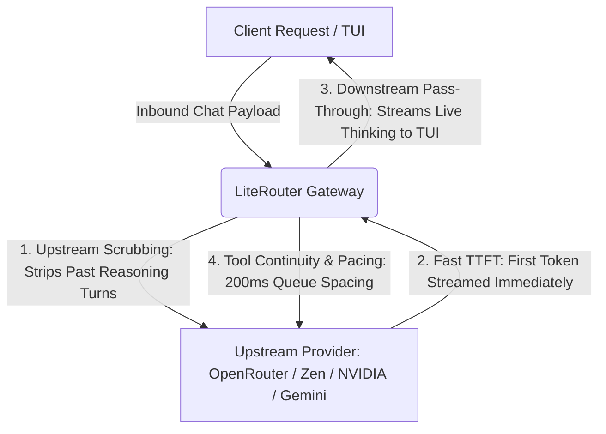

# LiteRouter Gold Standard Benchmarking & Regression Suite

This directory contains the authoritative, gold-standard test harness, benchmarking procedures, and invariants for **LiteRouter streaming, reasoning flow, and tool-calling parity**.

Any future pull requests, refactors, or modifications touching streaming pipelines, reasoning transformers, pacer queues, or upstream payload transformations **MUST** satisfy all criteria in this benchmark suite.

---

## 🎯 The 4 Invariants of the Gold Standard

Every change to LiteRouter must preserve the following 4 core invariants:



1. **Downstream Live Thinking Delivery (TUI Visibility)**
   - Reasoning deltas (`delta.reasoning`, `delta.reasoning_content`, `delta.thought`) must stream downstream to the client (OpenCode2 CLI, OpenCode TUI, Claude Code) in real-time as they arrive.
   - Downstream reasoning must NOT be withheld, suppressed, or replaced by synthetic 5-second heartbeats.
   - Suppression is only active when the client explicitly specifies the `sb` (Strip Budget) nuance directive.

2. **Upstream Outbound Payload Sanitization (Reasoning Scrubbing)**
   - When the client sends multi-turn conversation history containing prior assistant thinking/reasoning blocks, LiteRouter **MUST strip prior reasoning fields** (`reasoning_content`, `reasoning`, `reasoning_details`) before dispatching payloads upstream to providers.
   - This prevents upstream HTTP 400 Bad Request / Schema Rejection errors from providers that reject historical reasoning tokens.

3. **Sub-Second First-Chunk TTFT (Time to First Token)**
   - `readFirstContentChunkWithTimeout` must recognize content/thought signatures (`reasoning`, `reasoning_content`, `thought`, `delta`, `choices`, etc.) on packet #1.
   - No multi-packet buffering stalls or artificial TTFT timeouts during rapid generation.

4. **100% Multi-Turn Tool Calling & Conversation Parity**
   - Direct provider execution and LiteRouter proxy execution must yield identical tool call triggers, execution fidelity, argument capture, and assistant responses.
   - Provider pacer delays default to **200ms** across all providers for high-velocity agentic execution.

---

## 📁 Directory Structure

```
tests/benchmarking/
├── README.md                                 # This specification and operational manual
├── SKILL.md                                  # Reusable LLM agent skill definition
├── run_benchmarks.sh                         # Interactive/CI benchmark execution runner
└── streaming_reasoning_benchmark.test.ts     # Automated unit & invariant test assertions
```

---

## 🚀 Execution & Verification Commands

### 1. Run Automated Invariant Unit Tests
```bash
bun test tests/benchmarking/streaming_reasoning_benchmark.test.ts
```
*Expected Output:* `6 pass, 0 fail, 28 expect() calls` (exit code 0).

### 2. Run Full Automated Gateway Benchmark
```bash
tests/benchmarking/run_benchmarks.sh
```
*Executes:*
- Gateway health check (`/health`)
- Automated invariant unit tests
- Live streaming & thinking probe on `ox-alpha` (`lr-or-oa-ch-no`)
- Live multi-turn payload scrubbing probe on `hy3-free` (`lr-zn-oa-ch-no`)

### 3. Run OpenCode2 CLI Parity Comparison
Compare direct vs LiteRouter behavior:
```bash
# LiteRouter Route (ox-alpha)
opencode2 run -m lr-or/stealth/ox-alpha --auto "Use bash to echo 'PARITY_TEST' and report what it printed."

# Direct Provider Route (Zen hy3-free)
opencode2 run -m opencode/hy3-free --auto "Use bash to echo 'PARITY_TEST' and report what it printed."

# LiteRouter Route (Zen hy3-free)
opencode2 run -m lr-zn/hy3-free --auto "Use bash to echo 'PARITY_TEST' and report what it printed."
```

---

## 📊 Parity Verification Matrix

| Evaluation Dimension | Direct Provider | LiteRouter Gateway | Acceptance Criteria |
|---|---|---|---|
| **Downstream Thinking Stream** | Emits live thinking | Emits live thinking | Zero synthetic delay; visible in TUI |
| **Upstream Outbound Payload** | Raw client payload | Scrubbed reasoning history | Prior `reasoning_content` removed |
| **Tool Execution Round-Trip** | Tool invoked $\to$ Result $\to$ Answer | Tool invoked $\to$ Result $\to$ Answer | Identical exit code and output |
| **Provider Pacing** | N/A (Uncontrolled) | 200ms Queue Interval | Anti-429 burst smoothing |
| **Key Pool Rotation** | Static key | Round-Robin across pool | Automatic fallback on 429/500 |

---

## 🚨 Strict Failure Criteria (Go/No-Go Gate)

A change **FAILS** the Gold Standard if:
- ❌ Downstream reasoning is suppressed without explicit `sb` nuance.
- ❌ Upstream payload retains past reasoning blocks causing HTTP 400.
- ❌ TTFT exceeds provider raw latency by > 500ms due to proxy buffering.
- ❌ Any test in `tests/benchmarking/` fails.
